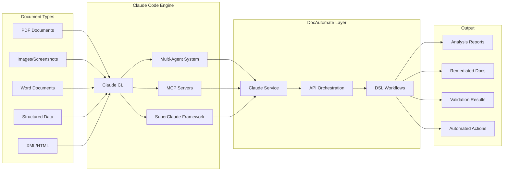
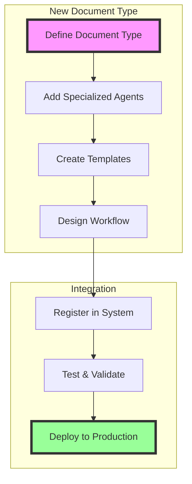

# DocAutomate Architecture - Claude Code as Primary Engine

## System Generalization Strategy

DocAutomate demonstrates how **Claude Code serves as a universal multi-modal agentic engine** for document processing, enabling generalization to any document type through:

### 1. Claude Code as the Foundation



### 2. DSL Workflow Generalization Pattern

Any document type can be processed using the same workflow structure:

```yaml
name: "universal_document_processor"
parameters:
  - name: "document_type"
    type: "string"
    description: "Type of document (contract, medical, financial, technical)"

steps:
  # Step 1: Claude understands ANY document format
  - type: "claude_analyze"
    config:
      prompt: "Identify document type and structure for {{ document_type }}"
      
  # Step 2: Route to specialized agents based on content
  - type: "claude_delegate"
    config:
      agent: "{{ 'medical-review' if document_type == 'medical' else 'general-purpose' }}"
      
  # Step 3: Multi-model validation for any content
  - type: "claude_consensus"
    config:
      models: ["gpt-5", "claude-opus-4.1", "gpt-4.1"]
      
  # Step 4: Generate improvements for any document
  - type: "claude_remediate"
    config:
      template: "{{ document_type }}_remediation"
```

### 3. How It Generalizes

#### A. Multi-Modal Understanding
Claude Code processes **ANY** input format:
- **Text**: PDF, DOCX, TXT, Markdown
- **Images**: Screenshots, diagrams, handwritten notes
- **Structured**: JSON, XML, YAML, CSV
- **Mixed**: Documents with embedded images, tables, code

#### B. Agent Specialization
Add domain-specific agents without changing core architecture:

```python
# Medical domain
class MedicalReviewAgent:
    capabilities = ["HIPAA compliance", "medical terminology", "privacy validation"]

# Legal domain  
class LegalReviewAgent:
    capabilities = ["contract analysis", "compliance checking", "risk assessment"]

# Financial domain
class FinancialAuditAgent:
    capabilities = ["SOX compliance", "fraud detection", "regulatory validation"]
```

#### C. Template-Based Remediation
Create domain-specific improvement templates:

```yaml
# templates/medical_remediation.yaml
templates:
  - id: "add_hipaa_notice"
    condition: "missing_privacy_notice"
    action: "prepend"
    content: "HIPAA NOTICE: Protected health information..."

# templates/financial_remediation.yaml
templates:
  - id: "add_disclaimer"
    condition: "missing_disclaimer"
    action: "append"
    content: "FINANCIAL DISCLAIMER: Past performance..."
```

### 4. Real-World Applications

#### Medical Records Processing
```bash
curl -X POST http://localhost:8001/orchestrate/workflow \
  -d '{
    "document_id": "med_record_001",
    "workflow_type": "medical_compliance",
    "agents": ["medical-review", "privacy-officer", "quality-engineer"],
    "config": {
      "compliance_standards": ["HIPAA", "HL7"],
      "redaction_required": true
    }
  }'
```

#### Legal Contract Analysis
```bash
curl -X POST http://localhost:8001/orchestrate/workflow \
  -d '{
    "document_id": "contract_001",
    "workflow_type": "legal_review",
    "agents": ["legal-review", "risk-analyst", "compliance-officer"],
    "config": {
      "jurisdiction": "US",
      "contract_type": "employment"
    }
  }'
```

#### Financial Report Validation
```bash
curl -X POST http://localhost:8001/orchestrate/workflow \
  -d '{
    "document_id": "report_q4_2024",
    "workflow_type": "financial_audit",
    "agents": ["financial-auditor", "compliance-officer", "fraud-detector"],
    "config": {
      "standards": ["SOX", "GAAP"],
      "risk_threshold": 0.05
    }
  }'
```

### 5. Extensibility Architecture



### 6. Why This Architecture Scales

1. **Claude Code Handles Complexity**: The AI engine understands context, making intelligent decisions without hardcoded rules

2. **DSL Provides Structure**: Workflows define the process, not the content understanding

3. **APIs Enable Integration**: RESTful endpoints allow any system to leverage the capabilities

4. **Async Processing**: Handle thousands of documents concurrently

5. **Stateless Design**: Horizontal scaling by adding more API instances

### 7. Implementation Example: Adding Invoice Processing

```python
# 1. Create agent (agent_providers.py)
@agent_registry.register
class InvoiceProcessorAgent(BaseAgent):
    name = "invoice-processor"
    capabilities = [
        "line item extraction",
        "tax calculation validation",
        "vendor verification"
    ]

# 2. Create workflow (workflows/invoice_processing.yaml)
name: "invoice_processing"
steps:
  - type: "claude_delegate"
    config:
      agent: "invoice-processor"
      task: "Extract invoice details and validate calculations"
      
  - type: "data_transform"
    config:
      transformations:
        total: "{{ sum(line_items) }}"
        tax: "{{ total * tax_rate }}"
        
  - type: "api_call"
    config:
      url: "https://erp.company.com/invoices"
      method: "POST"
      body: "{{ invoice_data }}"

# 3. Use via API
curl -X POST http://localhost:8001/workflows/execute \
  -d '{
    "workflow_name": "invoice_processing",
    "document_id": "inv_2024_001"
  }'
```

## Conclusion

DocAutomate with Claude Code as its primary engine represents a **paradigm shift** in document processing:

- **Not Limited by Format**: Process anything Claude can read
- **Not Limited by Domain**: Add agents for any specialization
- **Not Limited by Complexity**: Multi-model consensus handles edge cases
- **Not Limited by Scale**: Async architecture supports enterprise loads

The system is truly generalized - the same architecture that processes NDAs can handle medical records, financial reports, technical documentation, or any future document type, all powered by Claude Code's multi-modal understanding capabilities.