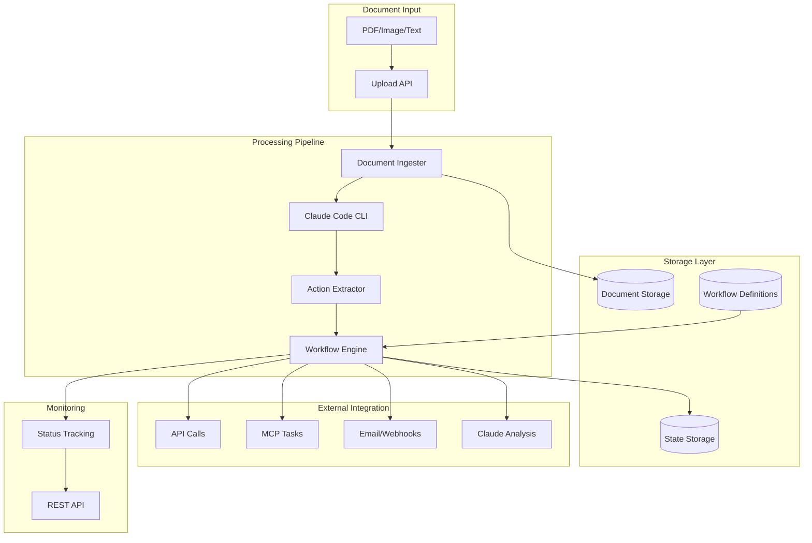
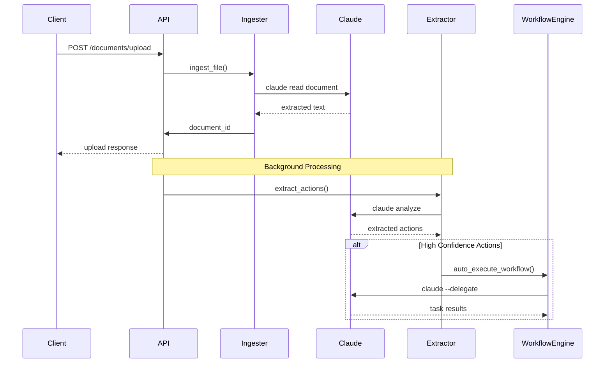

# DocAutomate Framework

Enterprise-ready document ingestion and action automation framework with **full Claude Code integration** for intelligent document processing and workflow automation.

## 🚀 Overview

DocAutomate is a sophisticated framework that combines document processing, AI-powered action extraction, and workflow automation in a single, enterprise-ready solution. It leverages Claude's NLP capabilities through the Claude Code CLI for real document analysis and intelligent automation.

### Key Features

- **🤖 Claude Code Integration**: Real document processing using Claude Code CLI
- **📄 Multi-format Document Processing**: PDF, images, text, Word docs, Excel files
- **🧠 Intelligent Action Extraction**: Claude's NLP for actionable item identification
- **⚡ Task Agent Execution**: Direct integration with Claude Task agents
- **📋 YAML-based Workflows**: Define complex automation workflows declaratively
- **🌐 REST API**: Full-featured FastAPI with async processing
- **✅ Pydantic Validation**: Structured, validated action extraction
- **🔄 Async Processing**: Background processing using FastAPI BackgroundTasks
- **📊 State Management**: Track workflow execution status
- **🔧 Extensible Action Registry**: Easy to add new action types
- **📈 Background Processing**: Non-blocking document ingestion with queue management

## 🏗️ Architecture



### Data Flow



## 🚀 Quick Start

### Prerequisites

```bash
# Install Claude Code (if not already installed)
# Visit: https://claude.ai/code

# Verify Claude Code is installed
claude --version
```

### Installation

```bash
# Clone the repository
git clone https://github.com/your-org/DocAutomate.git
cd DocAutomate

# Create virtual environment
python -m venv venv
source venv/bin/activate  # On Windows: venv\Scripts\activate

# Install dependencies
pip install -r requirements.txt

# Test Claude integration
python test_claude_integration.py
```

### Running the API

```bash
# Start the API server (default port 8000)
python api.py

# Or with custom configuration
uvicorn api:app --host 0.0.0.0 --port 8000 --reload
```

The API will be available at:
- **API Server**: `http://localhost:8000`
- **Interactive Docs**: `http://localhost:8000/docs`
- **OpenAPI Schema**: `http://localhost:8000/openapi.json`

## 📖 API Documentation

### Base URL
```
http://localhost:8000
```

### Authentication
Currently no authentication is required. For production deployment, implement JWT or API key authentication.

**Security Note:** CORS is currently configured to allow all origins (`*`) for development. In production, restrict CORS origins to specific domains for security.

### Content Types
- Request: `application/json` for JSON payloads, `multipart/form-data` for file uploads
- Response: `application/json`

### Error Responses
All endpoints return FastAPI standard error responses:
```json
{
  "detail": "Error message"
}
```

HTTP status codes indicate the error type (400 for client errors, 404 for not found, 500 for server errors).

---

## 📄 Document Endpoints

### 1. Upload Document

**POST** `/documents/upload`

Upload a document for processing and action extraction.

**Request:**
```bash
curl -X POST "http://localhost:8000/documents/upload" \
  -H "accept: application/json" \
  -H "Content-Type: multipart/form-data" \
  -F "file=@invoice.pdf" \
  -F "auto_process=true"
```

**Parameters:**
- `file` (required): Document file (PDF, image, text, Word, Excel)
- `auto_process` (optional): Boolean, default `true`. Process document in background

**Response:**
```json
{
  "document_id": "e2077163960199cc",
  "filename": "invoice.pdf",
  "status": "ingested",
  "message": "Document uploaded and queued for processing",
  "extracted_actions": null
}
```

### 2. List Documents

**GET** `/documents`

Retrieve all uploaded documents with optional status filtering.

**Request:**
```bash
# List all documents
curl -X GET "http://localhost:8000/documents"

# Filter by status
curl -X GET "http://localhost:8000/documents?status=processed"
```

**Parameters:**
- `status` (optional): Filter by status (`ingested`, `processed`, `failed`)

**Response:**
```json
[
  {
    "document_id": "e2077163960199cc",
    "filename": "invoice.pdf",
    "status": "processed",
    "ingested_at": "2024-09-24T14:30:00Z",
    "workflow_runs": ["run_12345"],
    "extracted_actions": [
      {
        "action_type": "process_invoice",
        "confidence_score": 0.95,
        "parameters": {
          "vendor_name": "ACME Corp",
          "amount": 15000.00,
          "invoice_id": "INV-2024-001"
        }
      }
    ]
  }
]
```

### 3. Get Document Details

**GET** `/documents/{document_id}`

Retrieve detailed information about a specific document.

**Request:**
```bash
curl -X GET "http://localhost:8000/documents/e2077163960199cc"
```

**Response:**
```json
{
  "document_id": "e2077163960199cc",
  "filename": "invoice.pdf",
  "status": "processed",
  "ingested_at": "2024-09-24T14:30:00Z",
  "workflow_runs": ["run_12345"],
  "extracted_actions": [
    {
      "action_type": "process_invoice",
      "confidence_score": 0.95,
      "workflow_name": "process_invoice",
      "parameters": {
        "vendor_name": "ACME Corp",
        "amount": 15000.00,
        "currency": "USD",
        "invoice_id": "INV-2024-001",
        "due_date": "2024-10-15"
      }
    }
  ]
}
```

### 4. Extract Actions from Document

**POST** `/documents/{document_id}/extract`

Manually trigger action extraction for a specific document.

**Request:**
```bash
curl -X POST "http://localhost:8000/documents/e2077163960199cc/extract" \
  -H "accept: application/json"
```

**Response:**
```json
{
  "message": "Action extraction queued",
  "document_id": "e2077163960199cc"
}
```

---

## 🔄 Workflow Endpoints

### 5. List Available Workflows

**GET** `/workflows`

Get all available workflow definitions.

**Request:**
```bash
curl -X GET "http://localhost:8000/workflows"
```

**Response:**
```json
{
  "workflows": [
    {
      "name": "process_invoice",
      "description": "Process incoming invoices for payment and approval",
      "version": "1.0.0",
      "parameters": [
        {
          "name": "invoice_id",
          "type": "string",
          "required": true,
          "description": "Unique invoice identifier"
        },
        {
          "name": "vendor_name",
          "type": "string",
          "required": true,
          "description": "Name of the vendor/supplier"
        },
        {
          "name": "amount",
          "type": "float",
          "required": true,
          "description": "Total invoice amount"
        }
      ]
    }
  ]
}
```

### 6. Get Workflow Definition

**GET** `/workflows/{workflow_name}`

Get detailed definition of a specific workflow.

**Request:**
```bash
curl -X GET "http://localhost:8000/workflows/process_invoice"
```

**Response:**
```json
{
  "name": "process_invoice",
  "description": "Process incoming invoices for payment and approval",
  "version": "1.0.0",
  "parameters": [...],
  "steps": [
    {
      "id": "validate_vendor",
      "type": "api_call",
      "description": "Validate vendor exists in system",
      "config": {
        "url": "https://api.company.com/vendors/validate",
        "method": "POST"
      }
    }
  ],
  "metadata": {
    "author": "DocAutomate Framework",
    "category": "finance",
    "tags": ["invoice", "payment", "approval"]
  }
}
```

### 7. Execute Workflow

**POST** `/workflows/execute`

Execute a workflow with specified parameters.

**Request:**
```bash
curl -X POST "http://localhost:8000/workflows/execute" \
  -H "Content-Type: application/json" \
  -d '{
    "document_id": "e2077163960199cc",
    "workflow_name": "process_invoice",
    "parameters": {
      "invoice_id": "INV-2024-001",
      "vendor_name": "ACME Corp",
      "amount": 15000.00,
      "currency": "USD",
      "due_date": "2024-10-15"
    },
    "auto_execute": false
  }'
```

**Parameters:**
- `document_id` (required): ID of the source document
- `workflow_name` (required): Name of workflow to execute
- `parameters` (required): Workflow-specific parameters
- `auto_execute` (optional): If `true`, execute synchronously; if `false`, queue for background execution

**Response:**
```json
{
  "run_id": "pending",
  "workflow_name": "process_invoice",
  "document_id": "e2077163960199cc",
  "status": "queued",
  "message": "Workflow queued for execution"
}
```

**Note:** When `auto_execute=true`, the response will include a real `run_id` and status of "running".

### 8. List Workflow Runs

**GET** `/workflows/runs`

List all workflow execution runs.

**Request:**
```bash
# List all runs
curl -X GET "http://localhost:8000/workflows/runs"

# Filter by workflow name
curl -X GET "http://localhost:8000/workflows/runs?workflow_name=process_invoice"
```

**Parameters:**
- `workflow_name` (optional): Filter runs by workflow name

**Response:**
```json
{
  "runs": [
    {
      "run_id": "run_12345",
      "workflow_name": "process_invoice",
      "document_id": "e2077163960199cc",
      "status": "completed",
      "started_at": "2024-09-24T14:35:00Z",
      "completed_at": "2024-09-24T14:37:30Z"
    }
  ]
}
```

### 9. Get Workflow Run Status

**GET** `/workflows/runs/{run_id}`

Get detailed status of a specific workflow run.

**Request:**
```bash
curl -X GET "http://localhost:8000/workflows/runs/run_12345"
```

**Response:**
```json
{
  "run_id": "run_12345",
  "workflow_name": "process_invoice",
  "status": "completed",
  "started_at": "2024-09-24T14:35:00Z",
  "completed_at": "2024-09-24T14:37:30Z",
  "current_step": null,
  "outputs": {
    "validate_vendor": {
      "status": "success",
      "response": {
        "vendor_id": "vendor_123",
        "valid": true
      }
    },
    "schedule_payment": {
      "status": "success",
      "payment_id": "payment_456"
    }
  },
  "error": null
}
```

---

## 🔧 System Endpoints

### 10. Health Check

**GET** `/health`

Check system health and component status.

**Request:**
```bash
curl -X GET "http://localhost:8000/health"
```

**Response:**
```json
{
  "status": "healthy",
  "components": {
    "ingester": "operational",
    "extractor": "operational",
    "workflow_engine": "operational",
    "api": "operational"
  }
}
```

### 11. API Information

**GET** `/`

Get API version and available endpoints.

**Request:**
```bash
curl -X GET "http://localhost:8000/"
```

**Response:**
```json
{
  "name": "DocAutomate API",
  "version": "1.0.0",
  "endpoints": {
    "upload": "/documents/upload",
    "list_documents": "/documents",
    "document_status": "/documents/{document_id}",
    "execute_workflow": "/workflows/execute",
    "list_workflows": "/workflows",
    "workflow_status": "/workflows/runs/{run_id}"
  }
}
```

---

## 🔍 Claude Code Integration

DocAutomate features **complete integration** with Claude Code CLI for real document processing:

### Integration Points

| Component | Integration | Command | Purpose |
|-----------|-------------|---------|---------|
| **Document Reading** | `claude read <file>` | Text extraction | PDF/image processing |
| **Action Extraction** | `claude --json` | NLP analysis | Structured action identification |
| **Task Execution** | `claude --delegate` | Agent coordination | Workflow step execution |
| **Analysis** | `claude` | Content analysis | Document summarization |

### How It Works

1. **CLI Wrapper** (`claude_cli.py`): Subprocess wrapper for Claude commands
2. **Automatic Detection**: Falls back gracefully if Claude Code not available
3. **Real Processing**: When Claude is available, all processing is genuine, not simulated

### Testing Integration

```bash
# Run integration test to verify Claude Code is working
python test_claude_integration.py

# Expected output:
# ✅ Claude Code Integration: ACTIVE (if installed)
# ⚠️ Claude Code Integration: SIMULATED (if not installed)
```

## 📂 Project Structure

```
DocAutomate/
├── api.py              # FastAPI REST endpoints
├── ingester.py         # Document ingestion and storage
├── extractor.py        # Action extraction with Claude NLP
├── workflow.py         # Workflow execution engine
├── claude_cli.py       # Claude Code CLI wrapper
├── requirements.txt    # Python dependencies
├── test_sample.py      # Sample test script
├── test_claude_integration.py  # Integration test
├── workflows/          # YAML workflow definitions
│   └── invoice.yaml   # Example invoice processing workflow
├── storage/           # Document storage (runtime)
├── state/            # Workflow state storage (runtime)
├── samples/          # Sample documents for testing
└── venv/            # Python virtual environment
```

## 🎯 Core Components

### 1. Document Ingester (`ingester.py`)
- **Multi-format Support**: PDF, images, text, Word docs, Excel files
- **Unique ID Generation**: SHA-256 based document identifiers
- **Claude Integration**: Uses `claude read` for text extraction
- **Storage Management**: Persistent document storage with metadata
- **Queue Processing**: Background document processing

**Key Classes:**
- `Document`: Dataclass representing ingested documents
- `DocumentIngester`: Main ingestion class with Claude integration

### 2. Action Extractor (`extractor.py`)
- **Claude NLP Integration**: Real AI-powered action extraction
- **Pydantic Models**: Structured, validated action representation
- **Confidence Scoring**: High/medium/low confidence classification
- **Auto-execution**: High-confidence actions trigger automatic workflows

**Key Classes:**
- `ExtractedAction`: Pydantic model for structured actions
- `ActionExtractor`: Main extraction class with Claude CLI integration

### 3. Workflow Engine (`workflow.py`)
- **YAML Definitions**: Declarative workflow configuration
- **Jinja2 Templating**: Dynamic parameter substitution
- **Action Registry**: Extensible system for step types
- **State Management**: Persistent workflow execution tracking
- **Parallel Execution**: Concurrent step processing

**Supported Step Types:**
- `api_call`: External API integration
- `mcp_task`: Claude Task agent execution
- `conditional`: If/else branching logic
- `parallel`: Concurrent task execution
- `data_transform`: Data transformation between steps
- `send_email`: Email notifications
- `webhook`: External webhook calls
- `claude_analyze`: Claude-powered analysis

### 4. REST API (`api.py`)
- **FastAPI Framework**: Modern, async Python web framework
- **CORS Support**: Cross-origin resource sharing enabled
- **Background Tasks**: Non-blocking document processing
- **Comprehensive Error Handling**: Structured error responses
- **Interactive Documentation**: Auto-generated API docs

## 📋 Workflow Definition Format

Workflows are defined in YAML format with the following structure:

```yaml
name: "workflow_name"
description: "Workflow description"
version: "1.0.0"

parameters:
  - name: "param_name"
    type: "string|float|int|bool"
    required: true|false
    default: "default_value"
    description: "Parameter description"

steps:
  - id: "step_identifier"
    type: "step_type"
    description: "Step description"
    config:
      # Step-specific configuration
    on_error: "stop|continue|retry"  # Planned feature - not yet implemented

metadata:
  author: "Author Name"
  category: "workflow_category"
  tags: ["tag1", "tag2"]
  sla_hours: 24
  retry_policy:  # Planned feature - not yet implemented
    max_retries: 3
    backoff_seconds: 300
```

### Template Support

Workflows support Jinja2 templating for dynamic values:

```yaml
config:
  url: "https://api.example.com/{{ endpoint }}"
  body:
    amount: "{{ amount }}"
    vendor: "{{ vendor_name }}"
    previous_result: "{{ steps.validate_vendor.response.vendor_id }}"
```

Available template variables:
- Workflow parameters: `{{ parameter_name }}`
- Previous step results: `{{ steps.step_id.response }}`
- System variables: `{{ __timestamp__ }}`, `{{ __run_id__ }}`

## 🧪 Testing

### Run All Tests

```bash
# Install test dependencies
pip install pytest pytest-asyncio

# Run test suite
pytest

# Run with verbose output
pytest -v
```

### Sample Document Test

```bash
# Test with sample invoice
python test_sample.py
```

This will:
1. Create a sample invoice document
2. Ingest the document via API
3. Extract actions using Claude
4. Execute the invoice processing workflow
5. Display results at each step

### Claude Integration Test

```bash
# Test Claude Code integration
python test_claude_integration.py
```

Expected outputs:
- ✅ **Claude Code Integration: ACTIVE** (if Claude Code is installed)
- ⚠️ **Claude Code Integration: SIMULATED** (fallback mode)

## 📦 Dependencies

### Core Dependencies
```txt
fastapi==0.104.1          # Web framework
uvicorn[standard]==0.24.0 # ASGI server
pydantic==2.5.0          # Data validation
PyYAML==6.0.1            # YAML processing
jinja2==3.1.2            # Template engine
aiohttp==3.9.1           # Async HTTP client
aiofiles==23.2.1         # Async file operations
```

### Document Processing
```txt
pypdf==3.17.1            # PDF processing
Pillow==10.1.0           # Image processing
python-docx==1.1.0       # Word documents
openpyxl==3.1.2          # Excel files
```

### Development & Testing
```txt
pytest==7.4.3           # Testing framework
pytest-asyncio==0.21.1  # Async testing
black==23.11.0           # Code formatting
flake8==6.1.0            # Linting
```

### Production Deployment
```txt
gunicorn==21.2.0         # Production WSGI server
redis==5.0.1             # Job queue (future)
celery==5.3.4            # Task queue (future)
sqlalchemy==2.0.23       # Database ORM (future)
```

## 🚀 Production Deployment

### Environment Variables

```bash
# API Configuration
API_HOST=0.0.0.0
API_PORT=8000
DEBUG=false

# Claude Code Integration
CLAUDE_CLI_PATH=/usr/local/bin/claude
CLAUDE_TIMEOUT=300

# Storage Configuration
STORAGE_PATH=/app/storage
STATE_PATH=/app/state
WORKFLOWS_PATH=/app/workflows

# External API Tokens (for workflows)
FINANCE_API_TOKEN=your_finance_token
SLACK_WEBHOOK_URL=your_slack_webhook
```

### Docker Deployment

```dockerfile
FROM python:3.11-slim

WORKDIR /app
COPY requirements.txt .
RUN pip install -r requirements.txt
# Install production WSGI server
RUN pip install gunicorn

COPY . .
EXPOSE 8000

CMD ["gunicorn", "api:app", "-w", "4", "-k", "uvicorn.workers.UvicornWorker", "--bind", "0.0.0.0:8000"]
```

### Kubernetes Deployment

```yaml
apiVersion: apps/v1
kind: Deployment
metadata:
  name: docautomate
spec:
  replicas: 3
  selector:
    matchLabels:
      app: docautomate
  template:
    metadata:
      labels:
        app: docautomate
    spec:
      containers:
      - name: docautomate
        image: docautomate:latest
        ports:
        - containerPort: 8000
        env:
        - name: API_HOST
          value: "0.0.0.0"
        - name: API_PORT
          value: "8000"
```

## 🔮 Future Enhancements

### Planned Features
- **Redis/Celery Integration**: Distributed job queue for scalability
- **Database Backend**: SQLAlchemy integration for persistent storage
- **Authentication & Authorization**: JWT-based security
- **Multi-tenant Support**: Isolated processing for multiple organizations
- **Real-time Monitoring**: Metrics dashboard and alerting
- **Scheduled Workflows**: Cron-like scheduled execution
- **Webhook Integration**: Real-time event notifications
- **Advanced AI Models**: Support for multiple AI providers

### Scalability Improvements
- **Horizontal Scaling**: Multi-instance deployment
- **Load Balancing**: Request distribution
- **Caching Layer**: Redis-based caching
- **Message Queues**: Async processing with RabbitMQ/Kafka

## 🤝 Contributing

### Development Setup

```bash
# Clone repository
git clone https://github.com/your-org/DocAutomate.git
cd DocAutomate

# Create development environment
python -m venv venv
source venv/bin/activate

# Install development dependencies
pip install -r requirements.txt
pip install -e .

# Install pre-commit hooks
pre-commit install
```

### Code Quality

```bash
# Format code
black .

# Lint code
flake8

# Type checking
mypy .

# Run tests
pytest
```

### Contribution Guidelines

1. Fork the repository
2. Create a feature branch: `git checkout -b feature/new-feature`
3. Make changes and add tests
4. Ensure all tests pass: `pytest`
5. Format code: `black .`
6. Submit a pull request

## 📜 License

This project is licensed under the MIT License - see the LICENSE file for details.

## 🆘 Support

### Documentation
- **API Docs**: `http://localhost:8000/docs`
- **OpenAPI Schema**: `http://localhost:8000/openapi.json`

### Troubleshooting

**Claude Integration Issues:**
```bash
# Check Claude installation
claude --version

# Test integration
python test_claude_integration.py
```

**API Issues:**
```bash
# Check API health
curl http://localhost:8000/health

# View logs
tail -f logs/docautomate.log
```

**Workflow Issues:**
```bash
# Validate workflow YAML
python -c "import yaml; yaml.safe_load(open('workflows/invoice.yaml'))"

# Check workflow run status
curl http://localhost:8000/workflows/runs/{run_id}
```

### Getting Help

1. Check the [Issues](https://github.com/your-org/DocAutomate/issues) page
2. Review the API documentation at `/docs`
3. Run integration tests: `python test_claude_integration.py`
4. Check logs for detailed error messages

---

**Built with ❤️ using Claude Code and FastAPI**