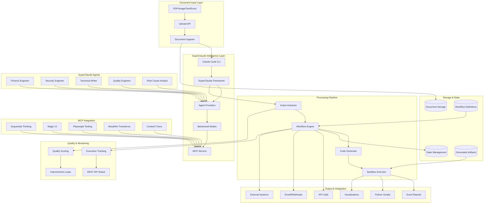
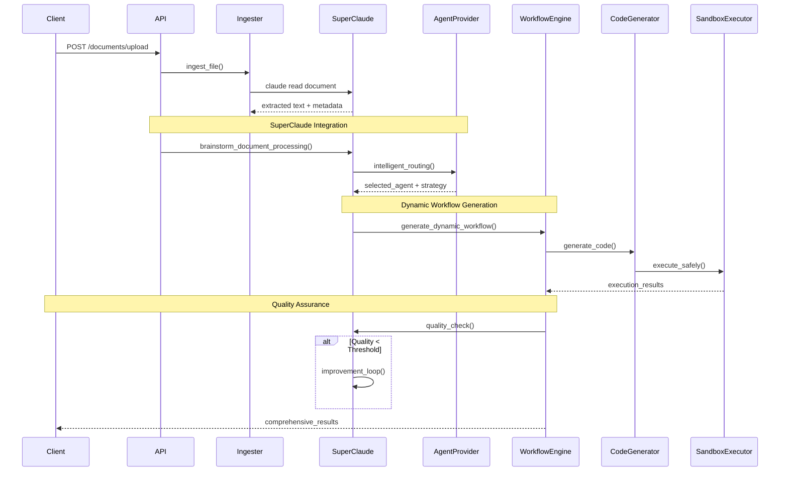

# DocAutomate Framework

**Enterprise-ready intelligent document processing and automation platform powered by the SuperClaude Framework**

[](LICENSE)
[](https://python.org)
[](https://fastapi.tiangolo.com)
[](https://claude.ai/code)

## 🚀 Overview

DocAutomate is a sophisticated framework that combines document processing, AI-powered action extraction, and workflow automation in a single, enterprise-ready solution. It leverages **Claude Code CLI** with **full SuperClaude Framework integration** for intelligent document analysis, automatic workflow generation, dynamic code creation, and specialized agent routing.

### Key Features

- 🤖 **SuperClaude Framework Integration**: Intelligent agent routing, behavioral modes, and MCP server utilization
- 📄 **Multi-format Document Processing**: PDF, images, text, Word docs, Excel files with Claude Code CLI
- 🧠 **Intelligent Action Extraction**: AI-powered actionable item identification with confidence scoring
- ⚡ **Dynamic Workflow Engine**: YAML-based workflows with SuperClaude action types
- 👨‍💻 **Automated Code Generation**: Python scripts for analysis, visualization, and automation
- 🔒 **Secure Sandbox Execution**: Safe code execution environment with configurable security levels
- 🎯 **Specialized Agent Routing**: Finance, security, technical writing, and quality engineering agents
- 📋 **Quality Assurance Loops**: Automated quality validation and improvement iterations
- 🌐 **REST API**: Full-featured FastAPI with async processing and comprehensive documentation
- 🔄 **Background Processing**: Non-blocking document ingestion with intelligent queue management

## 🏗️ Architecture



### Data Flow



## 🚀 Quick Start

### Prerequisites

```bash
# Install Claude Code CLI (required for full functionality)
# Visit: https://claude.ai/code for installation instructions

# Verify Claude Code installation
claude --version
```

### Installation

```bash
# Clone the repository
git clone https://github.com/your-org/DocAutomate.git
cd DocAutomate

# Create virtual environment
python -m venv venv
source venv/bin/activate  # On Windows: venv\Scripts\activate

# Install dependencies
pip install -r requirements.txt

# Test SuperClaude integration
python -c "from claude_cli import ClaudeCLI; print('✅ SuperClaude integration ready')"
```

### Running the System

```bash
# Start the API server
python api.py

# Or with custom configuration
uvicorn api:app --host 0.0.0.0 --port 8001 --reload
```

**Available Services:**
- **API Server**: `http://localhost:8001`
- **Interactive Docs**: `http://localhost:8001/docs`
- **OpenAPI Schema**: `http://localhost:8001/openapi.json`

## 📖 API Documentation

### Base Configuration

```bash
# Base URL
http://localhost:8001

# Content Types
Request: application/json (JSON) | multipart/form-data (file uploads)
Response: application/json

# Authentication
Currently no authentication required. For production, implement JWT or API key authentication.

# CORS
Development: Allow all origins (*)
Production: Restrict to specific domains
```

### Core Endpoints

#### 1. Upload Document with SuperClaude Processing

**POST** `/documents/upload`

Upload and automatically process documents using SuperClaude intelligence.

```bash
curl -X POST "http://localhost:8001/documents/upload" \
  -H "accept: application/json" \
  -H "Content-Type: multipart/form-data" \
  -F "file=@financial_report.pdf" \
  -F "auto_process=true"
```

**Response:**
```json
{
  "document_id": "a7b8c9d012345678",
  "filename": "financial_report.pdf",
  "status": "ingested",
  "message": "Document uploaded and queued for SuperClaude processing",
  "extracted_actions": null
}
```

#### 2. List Documents with Processing Status

**GET** `/documents?status=processed`

```bash
# List all documents
curl -X GET "http://localhost:8001/documents"

# Filter by processing status
curl -X GET "http://localhost:8001/documents?status=processed"
```

**Response:**
```json
[
  {
    "document_id": "a7b8c9d012345678",
    "filename": "financial_report.pdf",
    "status": "processed",
    "ingested_at": "2024-09-25T14:30:00Z",
    "workflow_runs": ["run_abc123"],
    "extracted_actions": [
      {
        "action_type": "invoice_processing",
        "workflow_name": "excel_automation",
        "confidence_score": 0.95,
        "parameters": {
          "vendor_name": "ACME Corp",
          "amount": 15000.00,
          "invoice_id": "INV-2024-001"
        }
      }
    ]
  }
]
```

#### 3. Get Document with SuperClaude Analysis

**GET** `/documents/{document_id}`

```bash
curl -X GET "http://localhost:8001/documents/a7b8c9d012345678"
```

**Response:**
```json
{
  "document_id": "a7b8c9d012345678",
  "filename": "financial_report.pdf",
  "status": "processed",
  "ingested_at": "2024-09-25T14:30:00Z",
  "workflow_runs": ["run_abc123"],
  "extracted_actions": [
    {
      "action_type": "invoice_processing",
      "workflow_name": "excel_automation",
      "confidence_score": 0.95,
      "confidence_level": "high",
      "parameters": {
        "vendor_name": "ACME Corp",
        "amount": 15000.00,
        "currency": "USD",
        "invoice_id": "INV-2024-001",
        "due_date": "2024-10-15"
      },
      "entities": [
        {
          "name": "vendor_name",
          "value": "ACME Corp",
          "confidence": 0.98,
          "location": "page 1, line 3"
        }
      ],
      "priority": 2,
      "deadline": "2024-10-15"
    }
  ]
}
```

#### 4. Execute SuperClaude-Enhanced Workflow

**POST** `/workflows/execute`

Execute workflows with intelligent agent routing and code generation.

```bash
curl -X POST "http://localhost:8001/workflows/execute" \
  -H "Content-Type: application/json" \
  -d '{
    "document_id": "a7b8c9d012345678",
    "workflow_name": "excel_automation",
    "parameters": {
      "document_content": "Financial report with Q3 revenue data...",
      "extracted_data": {
        "revenue": 250000,
        "expenses": 180000,
        "profit_margin": 0.28
      },
      "output_filename": "q3_financial_analysis.xlsx"
    },
    "auto_execute": true
  }'
```

**Response:**
```json
{
  "run_id": "run_def456",
  "workflow_name": "excel_automation",
  "document_id": "a7b8c9d012345678",
  "status": "running",
  "message": "SuperClaude workflow executing with finance-engineer agent"
}
```

#### 5. List SuperClaude-Enhanced Workflows

**GET** `/workflows`

```bash
curl -X GET "http://localhost:8001/workflows"
```

**Response:**
```json
{
  "workflows": [
    {
      "name": "excel_automation",
      "description": "Automated Excel processing with data analysis and visualization",
      "version": "1.0.0",
      "parameters": [
        {
          "name": "document_content",
          "type": "string",
          "required": true,
          "description": "Extracted document content"
        },
        {
          "name": "extracted_data",
          "type": "object",
          "required": true,
          "description": "Structured data extracted from document"
        }
      ],
      "steps": 9,
      "superclaude_features": [
        "intelligent_routing",
        "code_generation", 
        "quality_check",
        "agent_task"
      ]
    },
    {
      "name": "data_analysis_automation",
      "description": "Comprehensive data analysis with multi-format reporting",
      "version": "1.0.0",
      "parameters": [...],
      "steps": 7,
      "superclaude_features": [
        "brainstorm_strategy",
        "specialized_agents",
        "dynamic_workflow"
      ]
    }
  ]
}
```

#### 6. Get Workflow Run Status with Quality Metrics

**GET** `/workflows/runs/{run_id}`

```bash
curl -X GET "http://localhost:8001/workflows/runs/run_def456"
```

**Response:**
```json
{
  "run_id": "run_def456",
  "workflow_name": "excel_automation",
  "status": "success",
  "started_at": "2024-09-25T14:35:00Z",
  "completed_at": "2024-09-25T14:42:30Z",
  "current_step": null,
  "outputs": {
    "intelligent_routing": {
      "selected_agent": "finance-engineer",
      "routing_confidence": 0.94,
      "agent_specialization": "financial_analysis"
    },
    "generate_analysis_code": {
      "status": "success",
      "code_generated": true,
      "script_path": "analysis_script.py"
    },
    "generate_excel_code": {
      "status": "success",
      "excel_created": true,
      "output_file": "q3_financial_analysis.xlsx",
      "sheets_created": ["Summary", "Data", "Charts"]
    },
    "quality_check": {
      "quality_score": 0.92,
      "completeness": 0.95,
      "accuracy": 0.89,
      "formatting": 0.91
    },
    "create_visualizations": {
      "status": "success",
      "charts_generated": ["revenue_trend", "expense_breakdown", "profit_analysis"],
      "visualization_file": "financial_charts.png"
    }
  },
  "error": null,
  "superclaude_metadata": {
    "agents_used": ["finance-engineer"],
    "modes_activated": ["task-manage", "orchestrate"],
    "code_execution_time": "45.2s",
    "quality_iterations": 1
  }
}
```

#### 7. System Health with SuperClaude Status

**GET** `/health`

```bash
curl -X GET "http://localhost:8001/health"
```

**Response:**
```json
{
  "status": "healthy",
  "components": {
    "api": "operational",
    "ingester": "operational", 
    "extractor": "operational",
    "workflow_engine": "operational",
    "claude_code_cli": "operational",
    "superclaude_framework": "operational"
  },
  "superclaude_status": {
    "agents_available": 8,
    "mcp_servers_active": 5,
    "behavioral_modes": 6,
    "code_generation": "enabled",
    "sandbox_executor": "secure"
  }
}
```

## 🧠 SuperClaude Framework Integration

DocAutomate includes **complete SuperClaude Framework integration** for intelligent document processing:

### Behavioral Modes

| Mode | Usage | Purpose |
|------|-------|---------|
| `--brainstorm` | Unknown document types | Collaborative requirement discovery |
| `--task-manage` | Complex multi-step operations | Hierarchical task organization |
| `--orchestrate` | Resource optimization | Intelligent tool selection and parallelization |
| `--loop` | Quality improvement | Iterative enhancement until threshold met |
| `--delegate` | Agent routing | Automatic specialist selection |

### Specialized Agents

| Agent | Specialization | Use Cases |
|-------|---------------|-----------|
| **finance-engineer** | Financial analysis, invoices, payments | Invoice processing, financial reporting |
| **security-engineer** | NDAs, compliance, access controls | Contract review, security validation |
| **technical-writer** | Documentation, reports, summaries | Report generation, documentation |
| **quality-engineer** | Validation, scoring, improvements | Quality assurance, threshold validation |
| **root-cause-analyst** | Problem analysis, classification | Unknown document analysis |

### MCP Server Integration

| MCP Server | Capability | Integration Point |
|------------|------------|-------------------|
| **Sequential** | Multi-step reasoning | Complex analysis workflows |
| **Magic** | UI component generation | Review interfaces, dashboards |
| **Playwright** | Browser automation | Web form filling, testing |
| **Morphllm** | Bulk transformations | Multi-document processing |
| **Context7** | Documentation lookup | Pattern guidance, standards |

### Dynamic Code Generation

DocAutomate automatically generates Python scripts for:

- **Data Analysis**: Statistical analysis with pandas/numpy
- **Excel Manipulation**: Multi-sheet workbooks with formatting
- **Visualizations**: Charts and graphs with matplotlib
- **File Operations**: Organization and management scripts
- **API Integration**: External system connections

### Quality Assurance System

- **Confidence Scoring**: 0.0-1.0 scale with threshold filtering
- **Quality Metrics**: Completeness, accuracy, formatting validation
- **Improvement Loops**: Automatic iteration until quality targets met
- **Agent Validation**: Specialist review for domain-specific content

## 📂 Project Structure

```
DocAutomate/
├── api.py                          # FastAPI REST endpoints with SuperClaude integration
├── ingester.py                     # Document ingestion with Claude Code CLI
├── extractor.py                    # AI-powered action extraction
├── workflow.py                     # Enhanced workflow engine with SuperClaude actions
├── claude_cli.py                   # Claude Code CLI wrapper with SuperClaude modes
├── agent_providers.py              # SuperClaude agent registry and routing
├── code_generator.py               # Dynamic Python code generation engine
├── sandbox_executor.py             # Secure code execution environment
├── requirements.txt                # Dependencies including SuperClaude requirements
├── workflows/                      # SuperClaude-enhanced workflow definitions
│   ├── excel_automation.yaml      # Excel processing with code generation
│   ├── data_analysis_automation.yaml # Comprehensive data analysis
│   ├── file_operations.yaml       # Intelligent file organization
│   ├── document_review.yaml       # Legal/compliance review workflows
│   └── invoice.yaml               # Traditional invoice processing
├── storage/                       # Document storage (runtime)
├── state/                         # Workflow state management (runtime)
├── samples/                       # Sample documents for testing
├── tests/                         # Test suite including SuperClaude tests
└── claudedocs/                    # SuperClaude-generated documentation
```

## 🎯 Core Components

### 1. Document Ingester (`ingester.py`)
- **Multi-format Support**: PDF, images, text, Word docs, Excel files
- **Claude Code Integration**: Uses `claude read` for intelligent text extraction
- **Unique ID Generation**: SHA-256 based document identifiers
- **Storage Management**: Persistent document storage with comprehensive metadata
- **Queue Processing**: Background document processing with intelligent routing

### 2. SuperClaude Action Extractor (`extractor.py`)
- **AI-Powered Extraction**: Real Claude Code NLP for actionable item identification
- **Confidence Scoring**: Intelligent confidence assessment with threshold filtering
- **Pydantic Validation**: Structured, validated action representation
- **Document Type Detection**: Automatic document classification
- **Agent Routing Hints**: Suggestions for optimal agent selection

### 3. Enhanced Workflow Engine (`workflow.py`)
- **YAML Definitions**: Declarative workflow configuration with SuperClaude extensions
- **SuperClaude Action Types**: 5 new action types for intelligent processing
- **Jinja2 Templating**: Dynamic parameter substitution with context awareness
- **Quality Gates**: Built-in quality validation and improvement loops
- **State Management**: Persistent workflow execution tracking with detailed metadata

### 4. Agent Provider System (`agent_providers.py`)
- **Unified Interface**: Single interface for all SuperClaude agents
- **Intelligent Routing**: Document-type-based automatic agent selection
- **Quality Scoring**: Agent performance tracking and optimization
- **Specialized Processing**: Domain-specific expertise for different document types

### 5. Dynamic Code Generator (`code_generator.py`)
- **Multi-Purpose Generation**: Analysis, visualization, automation scripts
- **Template-Based**: Secure, validated code generation with safety checks
- **Excel Specialization**: Advanced Excel workbook creation with formatting
- **Security Validation**: Code safety analysis before execution

### 6. Secure Sandbox Executor (`sandbox_executor.py`)
- **Safe Execution Environment**: Isolated code execution with resource limits
- **Security Levels**: Configurable security constraints (low/medium/high)
- **Artifact Collection**: Automatic collection of generated files and results
- **Error Handling**: Comprehensive error capture and reporting

## 📋 SuperClaude Workflow Actions

DocAutomate extends standard workflow actions with SuperClaude-powered capabilities:

### Standard Actions
- `api_call`: External API integration with authentication
- `send_email`: Email notifications with templating
- `webhook`: External webhook calls with retry logic
- `data_transform`: Data transformation between workflow steps
- `conditional`: If/else branching logic with complex conditions
- `parallel`: Concurrent task execution with dependency management

### SuperClaude Actions
- `agent_task`: Delegate to specialized SuperClaude agents
- `intelligent_routing`: Automatic agent selection based on document analysis
- `code_generation`: Dynamic Python script generation and execution
- `quality_check`: Automated quality validation with improvement suggestions
- `dynamic_workflow`: Runtime workflow generation based on document content

### Example Workflow Definition

```yaml
name: "excel_automation"
description: "Automated Excel processing with SuperClaude intelligence"
version: "1.0.0"

parameters:
  - name: "document_content"
    type: "string" 
    required: true
  - name: "extracted_data"
    type: "object"
    required: true

steps:
  # Intelligent agent routing
  - id: "intelligent_routing"
    type: "intelligent_routing"
    config:
      document_meta:
        content_type: "financial"
        extracted_data: "{{ extracted_data }}"
      mode: "automatic"

  # Dynamic code generation
  - id: "generate_excel_code"
    type: "code_generation"
    config:
      type: "excel_manipulation"
      language: "python"
      data: "{{ extracted_data }}"
      execute: true

  # Specialized agent processing
  - id: "agent_processing"
    type: "agent_task"
    config:
      agent_name: "{{ steps.intelligent_routing.selected_agent }}"
      context:
        document_content: "{{ document_content }}"
        extracted_data: "{{ extracted_data }}"

  # Quality assurance
  - id: "quality_validation"
    type: "quality_check"
    config:
      quality_threshold: 0.85
      checks: ["completeness", "accuracy", "formatting"]

metadata:
  author: "DocAutomate + SuperClaude Framework"
  superclaude_features:
    - "intelligent_routing"
    - "code_generation"
    - "quality_assurance"
    - "specialized_agents"
```

## 🧪 Testing & Validation

### Test SuperClaude Integration

```bash
# Test Claude Code CLI integration
python -c "
from claude_cli import ClaudeCLI
cli = ClaudeCLI()
if cli.validate_installation():
    print('✅ Claude Code: ACTIVE')
else:
    print('⚠️ Claude Code: SIMULATED MODE')
"

# Test agent providers
python -c "
from agent_providers import agent_registry
print(f'✅ SuperClaude agents available: {len(agent_registry)}')
"

# Test code generation
python -c "
from code_generator import CodeGenerator
gen = CodeGenerator()
print('✅ Dynamic code generation: READY')
"
```

### Run Sample Workflows

```bash
# Test Excel automation
python -c "
import asyncio
from workflow import WorkflowEngine

async def test():
    engine = WorkflowEngine()
    result = await engine.execute_workflow(
        'excel_automation',
        'test_doc_001',
        {
            'document_content': 'Sample financial data...',
            'extracted_data': {'revenue': 100000, 'expenses': 75000}
        }
    )
    print(f'✅ Workflow result: {result.status}')

asyncio.run(test())
"

# Test document processing pipeline
curl -X POST "http://localhost:8001/documents/upload" \
  -F "file=@samples/sample_invoice.pdf" \
  -F "auto_process=true"
```

### Quality Validation

```bash
# Test quality scoring system
python -c "
from extractor import ActionExtractor
import asyncio

async def test_quality():
    extractor = ActionExtractor(confidence_threshold=0.8)
    actions = await extractor.extract_actions('Invoice #001 for $5000')
    print(f'✅ Quality scoring: {len(actions)} high-confidence actions')

asyncio.run(test_quality())
"
```

## 📦 Dependencies

### Core Framework
```
fastapi==0.104.1              # Modern async web framework
uvicorn[standard]==0.24.0     # ASGI server
pydantic==2.5.0               # Data validation and serialization
PyYAML==6.0.1                 # YAML workflow processing
jinja2==3.1.2                 # Template engine for workflows
```

### Document Processing
```
pypdf==3.17.1                 # PDF processing
Pillow==10.1.0                # Image processing 
python-docx==1.1.0            # Word documents
openpyxl==3.1.2               # Excel file generation
```

### SuperClaude Framework
```
asyncio==3.4.3                # Async processing for agents
aiohttp==3.9.1                # HTTP client for API integrations  
aiofiles==23.2.1              # Async file operations
python-multipart==0.0.6       # File upload handling
```

### Code Generation & Analysis
```
pandas>=1.5.0                 # Data analysis (generated code)
numpy>=1.24.0                 # Numerical computing (generated code)
matplotlib>=3.6.0             # Visualizations (generated code)
seaborn>=0.12.0               # Statistical visualizations (generated code)
```

### Development & Testing
```
pytest==7.4.3                # Testing framework
pytest-asyncio==0.21.1       # Async testing support
black==23.11.0                # Code formatting
flake8==6.1.0                 # Code linting
```

## 🚀 Production Deployment

### Environment Configuration

```bash
# API Configuration
export API_HOST=0.0.0.0
export API_PORT=8001
export DEBUG=false

# Claude Code Integration
export CLAUDE_CLI_PATH=/usr/local/bin/claude
export CLAUDE_TIMEOUT=180

# SuperClaude Framework
export SUPERCLAUDE_AGENTS_ENABLED=true
export SUPERCLAUDE_CODE_GENERATION=true
export SUPERCLAUDE_QUALITY_THRESHOLD=0.85

# Storage Configuration
export STORAGE_PATH=/app/storage
export STATE_PATH=/app/state
export WORKFLOWS_PATH=/app/workflows

# Security
export SANDBOX_SECURITY_LEVEL=high
export MAX_CODE_EXECUTION_TIME=300
export ENABLE_CODE_GENERATION=true
```

### Docker Deployment

```dockerfile
FROM python:3.11-slim

WORKDIR /app

# Install system dependencies
RUN apt-get update && apt-get install -y \
    gcc \
    g++ \
    && rm -rf /var/lib/apt/lists/*

# Install Python dependencies
COPY requirements.txt .
RUN pip install --no-cache-dir -r requirements.txt

# Install Claude Code CLI (production setup)
# RUN curl -sSL https://claude.ai/install | sh

COPY . .

# Create necessary directories
RUN mkdir -p storage state workflows claudedocs

EXPOSE 8001

# Health check (requires curl to be installed)
RUN apt-get update && apt-get install -y curl && rm -rf /var/lib/apt/lists/*
HEALTHCHECK --interval=30s --timeout=10s --start-period=5s --retries=3 \
  CMD curl -f http://localhost:8001/health || exit 1

CMD ["python", "api.py"]
```

### Kubernetes Deployment

```yaml
apiVersion: apps/v1
kind: Deployment
metadata:
  name: docautomate-superclaude
  labels:
    app: docautomate
    version: superclaude
spec:
  replicas: 3
  selector:
    matchLabels:
      app: docautomate
  template:
    metadata:
      labels:
        app: docautomate
        version: superclaude
    spec:
      containers:
      - name: docautomate
        image: docautomate:superclaude-latest
        ports:
        - containerPort: 8001
        env:
        - name: API_HOST
          value: "0.0.0.0"
        - name: API_PORT
          value: "8001"
        - name: SUPERCLAUDE_AGENTS_ENABLED
          value: "true"
        - name: SUPERCLAUDE_QUALITY_THRESHOLD
          value: "0.85"
        resources:
          requests:
            memory: "512Mi"
            cpu: "500m"
          limits:
            memory: "2Gi" 
            cpu: "2000m"
        livenessProbe:
          httpGet:
            path: /health
            port: 8001
          initialDelaySeconds: 30
          periodSeconds: 30
        readinessProbe:
          httpGet:
            path: /health
            port: 8001
          initialDelaySeconds: 5
          periodSeconds: 10
---
apiVersion: v1
kind: Service
metadata:
  name: docautomate-service
spec:
  selector:
    app: docautomate
  ports:
  - port: 8001
    targetPort: 8001
  type: LoadBalancer
```

## 🎯 Use Cases & Examples

### 1. Financial Document Processing
```bash
# Upload financial report
curl -X POST "http://localhost:8001/documents/upload" \
  -F "file=@quarterly_report.pdf" \
  -F "auto_process=true"

# Expected processing:
# 1. finance-engineer agent analyzes document
# 2. Generates Python analysis script
# 3. Creates Excel workbook with charts
# 4. Quality validation (>85% threshold)
# 5. Executive summary generation
```

### 2. Contract & NDA Review
```bash
# Upload legal document
curl -X POST "http://localhost:8001/documents/upload" \
  -F "file=@software_nda.pdf" \
  -F "auto_process=true"

# Expected processing:
# 1. security-engineer agent reviews terms
# 2. Generates compliance checklist
# 3. Creates access control policies
# 4. Legal review workflow triggers
# 5. Signature requirements identified
```

### 3. Data Analysis Automation
```bash
# Execute data analysis workflow
curl -X POST "http://localhost:8001/workflows/execute" \
  -H "Content-Type: application/json" \
  -d '{
    "document_id": "data_export_001",
    "workflow_name": "data_analysis_automation",
    "parameters": {
      "analysis_type": "comprehensive",
      "generate_visualizations": true,
      "create_executive_summary": true
    }
  }'

# Expected outputs:
# 1. Statistical analysis report (PDF)
# 2. Interactive visualizations (HTML)
# 3. Executive summary (Word/PDF)
# 4. Raw analysis data (Excel)
# 5. Python analysis script (for reproducibility)
```

## 🔮 Advanced Features

### Quality-Driven Processing

DocAutomate includes sophisticated quality assurance:

- **Confidence-Based Filtering**: Only high-confidence actions are auto-executed
- **Quality Scoring**: Multi-dimensional quality assessment (0.0-1.0 scale)
- **Improvement Loops**: Automatic iteration until quality thresholds are met
- **Agent Validation**: Specialist review for domain-specific accuracy

### Dynamic Workflow Generation

The system can generate workflows dynamically:

```python
# Example: Auto-generated workflow for unknown document type
workflow_spec = await superclaude.brainstorm_document_processing(
    document_content=content,
    document_meta={"type": "unknown", "source": "email_attachment"}
)

# Result: Custom workflow optimized for the specific document
```

### Intelligent Resource Management

- **Parallel Processing**: Automatic identification of parallelizable operations
- **Agent Load Balancing**: Optimal agent selection based on current load
- **Execution Optimization**: Smart scheduling of CPU-intensive operations
- **Memory Management**: Efficient handling of large document processing

### Security & Compliance

- **Sandbox Execution**: All generated code runs in secure, isolated environments
- **Access Control**: Role-based access to sensitive workflows
- **Audit Trails**: Comprehensive logging of all processing activities  
- **Data Privacy**: Configurable data retention and anonymization

## 🤝 Contributing

### Development Setup

```bash
# Clone and setup development environment
git clone https://github.com/your-org/DocAutomate.git
cd DocAutomate

python -m venv venv
source venv/bin/activate
pip install -r requirements.txt
pip install -e .

# Install development tools
pip install pre-commit
pre-commit install
```

### Code Quality

```bash
# Format code
black .

# Lint code  
flake8 .

# Run tests
pytest -v

# Test SuperClaude integration
python -m pytest tests/test_superclaude_integration.py -v
```

### Adding New Agents

```python
# agent_providers.py
from agent_providers import AgentProvider, agent_registry

class CustomAgent(AgentProvider):
    name = "custom-specialist"
    specialization = "domain_specific_processing"
    confidence_threshold = 0.8
    
    async def process_document(self, content, context):
        # Custom processing logic
        return result

# Register the agent
agent_registry.register(CustomAgent())
```

### Creating Workflow Actions

```python
# workflow.py - Add to WorkflowEngine.action_registry
async def _execute_custom_action(self, config: Dict, state: Dict) -> Dict:
    """Custom workflow action implementation"""
    # Action logic here
    return {"status": "success", "result": "action_output"}

# Register in __init__
self.action_registry['custom_action'] = self._execute_custom_action
```

## 📜 License

This project is licensed under the MIT License - see the [LICENSE](LICENSE) file for details.

## 🆘 Support

### Documentation
- **Interactive API Docs**: `http://localhost:8001/docs`
- **OpenAPI Schema**: `http://localhost:8001/openapi.json`
- **SuperClaude Integration Guide**: See `claudedocs/` directory

### Troubleshooting

**Claude Integration Issues:**
```bash
# Verify Claude Code installation
claude --version

# Test integration
python -c "from claude_cli import ClaudeCLI; print('✅' if ClaudeCLI().validate_installation() else '❌')"

# Enable debug logging
export DEBUG=1
python api.py
```

**SuperClaude Agent Issues:**
```bash
# Check agent availability
python -c "from agent_providers import agent_registry; print(f'Agents: {list(agent_registry.agents.keys())}')"

# Test agent routing
curl -X POST "http://localhost:8001/debug/test_agent_routing" \
  -H "Content-Type: application/json" \
  -d '{"document_type": "invoice", "content_preview": "Invoice #001..."}'
```

**Workflow Execution Problems:**
```bash
# Validate workflow YAML
python -c "import yaml; yaml.safe_load(open('workflows/excel_automation.yaml'))"

# Check workflow run status
curl "http://localhost:8001/workflows/runs/{run_id}"

# Debug workflow step execution
export DEBUG=1
tail -f logs/workflow_execution.log
```

**Code Generation Issues:**
```bash
# Test code generation
python -c "
from code_generator import CodeGenerator
gen = CodeGenerator()
result = gen.generate_analysis_code({'revenue': 100000})
print(f'Generated: {len(result)} characters')
"

# Check sandbox security
python -c "
from sandbox_executor import SandboxExecutor
executor = SandboxExecutor(security_level='high')
print(f'Sandbox ready: {executor.is_secure()}')
"
```

### Getting Help

1. **Documentation**: Check `/docs` endpoint for interactive API documentation
2. **Health Check**: Monitor `/health` endpoint for system status  
3. **Logging**: Enable debug mode with `DEBUG=1` environment variable
4. **Issues**: Report bugs and feature requests via GitHub Issues
5. **Community**: Join discussions in the SuperClaude Framework community

---

**🚀 Transform your document processing workflows with SuperClaude-powered intelligence!**

*Built with ❤️ using Claude Code CLI and the SuperClaude Framework*