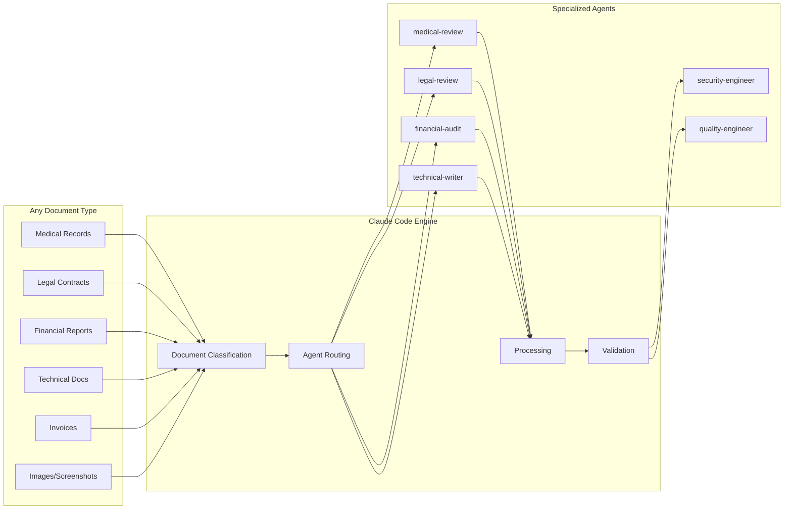

# DocAutomate Framework

**Enterprise Document Processing & Workflow Automation Platform**

[](LICENSE)
[](https://python.org)
[](https://fastapi.tiangolo.com)
[](https://claude.ai/code)

## 🚀 Overview

DocAutomate is a **pure API orchestration layer** that delegates ALL document processing to Claude Code agents through the SuperClaude Framework. With **ZERO local processing logic**, it serves as a universal document processor that generalizes to ANY document type - medical records, legal contracts, financial reports, technical documentation, and more.

### Architecture Principle: Complete Delegation
```
API Request → DSL Workflow → Claude Agent → Response
```
- **NO** local document processing logic
- **ALL** intelligence resides in Claude Code
- **DSL** defines WHAT to do, not HOW
- **Agents** handle all actual processing

### Core Features

- 🤖 **Pure Claude Code Delegation**: ALL operations processed by Claude agents, zero local logic
- 🌍 **Universal Document Support**: Medical, legal, financial, technical - ANY document type
- 📊 **Multi-Agent Orchestration**: Parallel execution with specialized domain agents
- 🔄 **DSL-Driven Workflows**: YAML configurations that generalize to any use case
- 🎯 **Intelligent Routing**: Automatic agent selection based on document content
- 📈 **Quality Loops**: Iterative improvement until quality thresholds met
- 🛡️ **Multi-Model Consensus**: Validation across GPT-5, Claude Opus 4.1, GPT-4.1
- 🌐 **Stateless REST API**: Horizontally scalable orchestration layer
- ♾️ **Infinite Extensibility**: Add capabilities through DSL without code changes

## 📋 Table of Contents

- [Architecture](#-architecture)
- [System Generalization](#-system-generalization)
- [Quick Start](#-quick-start)
- [Installation](#-installation)
- [API Documentation](#-api-documentation)
- [Claude Code Integration](#-claude-code-integration)
- [DSL Configuration](#-dsl-configuration)
- [Workflow System](#-workflow-system)
- [Real-World Applications](#-real-world-applications)
- [Production Deployment](#-production-deployment)

## 🏗️ Architecture


The architecture shows Claude Code as the primary processing engine, with DocAutomate providing the orchestration layer, workflow management, and API interface.

## 🌐 System Generalization

DocAutomate generalizes to **ANY document type** through Claude Code's multi-modal understanding:

### Universal Processing Pipeline



### Domain Extensibility

Add new document types without changing code - only DSL configuration:

```yaml
# dsl/agent-mappings.yaml - Add new domain
medical:
  primary: "medical-review"
  validators: ["hipaa-compliance", "privacy-officer"]
  templates: "medical_remediation"
  
financial:
  primary: "financial-audit"
  validators: ["sox-compliance", "fraud-detector"]
  templates: "financial_remediation"
  
# Your new domain
construction:
  primary: "construction-inspector"
  validators: ["building-codes", "safety-reviewer"]
  templates: "construction_remediation"
```

## 🚀 Quick Start

### 1. Prerequisites

```bash
# Install Claude Code CLI (required)
curl -sSf https://claude.ai/install.sh | sh

# Verify installation
claude --version
```

### 2. Installation

```bash
# Clone repository
git clone https://github.com/your-org/DocAutomate.git
cd DocAutomate

# Install dependencies
pip install -r requirements.txt

# Configure environment
cp .env.example .env
# Edit .env with your settings
```

### 3. Start the Server

```bash
# Start DocAutomate API
python api.py

# API available at: http://localhost:8001
# Documentation: http://localhost:8001/docs
```

### 4. Test with a Document

```bash
# Upload a document
curl -X POST "http://localhost:8001/documents/upload" \
  -H "Content-Type: multipart/form-data" \
  -F "file=@sample.pdf" \
  -F "auto_process=true"

# Check processing status
curl "http://localhost:8001/documents/{document_id}"
```

## 📦 Installation

### System Requirements

- Python 3.11+
- Claude Code CLI (latest)
- 4GB RAM minimum, 8GB recommended
- 10GB disk space for document storage

### Detailed Setup

```bash
# 1. Install system dependencies
sudo apt update
sudo apt install python3.11 python3.11-pip python3.11-venv

# 2. Create virtual environment
python3.11 -m venv venv
source venv/bin/activate  # Linux/Mac
# or
venv\Scripts\activate  # Windows

# 3. Install Python dependencies
pip install --upgrade pip
pip install -r requirements.txt

# 4. Install Claude Code CLI
curl -sSf https://claude.ai/install.sh | sh

# 5. Configure Claude Code permissions
export CLAUDE_AUTO_GRANT_FILE_ACCESS=true
export CLAUDE_TIMEOUT=300

# 6. Create required directories
mkdir -p storage logs workflows/custom docs/generated

# 7. Configure environment
cp .env.example .env
```

### Environment Configuration

```bash
# .env file
CLAUDE_CLI_PATH=claude
CLAUDE_TIMEOUT=300
CLAUDE_AUTO_GRANT_FILE_ACCESS=true
CLAUDE_AUDIT_LOG=true
DEBUG=false

# API Settings
API_PORT=8001
API_HOST=0.0.0.0
MAX_WORKERS=4

# Storage Settings
STORAGE_DIR=./storage
STATE_DIR=./state
WORKFLOWS_DIR=./workflows
```

## 📚 API Documentation

### Core Endpoints

#### Document Management

**Upload Document**
```bash
curl -X POST "http://localhost:8001/documents/upload" \
  -H "Content-Type: multipart/form-data" \
  -F "file=@document.pdf" \
  -F "auto_process=true"

# Response
{
  "document_id": "a1b2c3d4",
  "filename": "document.pdf",
  "status": "processing",
  "message": "Document uploaded and queued for processing"
}
```

**List Documents**
```bash
curl "http://localhost:8001/documents"

# Filter by status
curl "http://localhost:8001/documents?status=processed"

# Response
[
  {
    "document_id": "a1b2c3d4",
    "filename": "document.pdf",
    "status": "processed",
    "ingested_at": "2024-09-25T10:30:00Z",
    "workflow_runs": ["run_123", "run_124"],
    "extracted_actions": [...]
  }
]
```

**Get Document Status**
```bash
curl "http://localhost:8001/documents/a1b2c3d4"

# Response
{
  "document_id": "a1b2c3d4",
  "filename": "document.pdf",
  "status": "processed",
  "ingested_at": "2024-09-25T10:30:00Z",
  "workflow_runs": ["run_123"],
  "extracted_actions": [
    {
      "action_type": "signature_required",
      "workflow_name": "document_signature",
      "confidence_score": 0.95,
      "parameters": {
        "parties": ["Company A", "Company B"],
        "signature_fields": ["signature", "date", "initials"]
      }
    }
  ]
}
```

#### Workflow Management

**List Available Workflows**
```bash
curl "http://localhost:8001/workflows"

# Response
{
  "workflows": [
    {
      "name": "document_signature",
      "description": "Handle signature requirements for legal documents",
      "version": "1.0.0",
      "parameters": [...],
      "steps": 8
    },
    {
      "name": "multi_agent_analysis",
      "description": "Parallel multi-agent document analysis",
      "version": "2.0.0",
      "parameters": [...],
      "steps": 7
    }
  ]
}
```

**Execute Workflow**
```bash
curl -X POST "http://localhost:8001/workflows/execute" \
  -H "Content-Type: application/json" \
  -d '{
    "document_id": "a1b2c3d4",
    "workflow_name": "document_signature",
    "parameters": {
      "parties": ["Company A", "Company B"],
      "signature_fields": ["signature", "date"],
      "document_type": "NDA"
    },
    "auto_execute": true
  }'

# Response
{
  "run_id": "run_123",
  "workflow_name": "document_signature",
  "document_id": "a1b2c3d4",
  "status": "success",
  "message": "Workflow executed"
}
```

**Get Workflow Run Status**
```bash
curl "http://localhost:8001/workflows/runs/run_123"

# Response
{
  "run_id": "run_123",
  "workflow_name": "document_signature",
  "status": "success",
  "started_at": "2024-09-25T10:35:00Z",
  "completed_at": "2024-09-25T10:37:00Z",
  "current_step": null,
  "outputs": {
    "validate_parties": {...},
    "prepare_signature_request": {...},
    "notify_parties": {...}
  },
  "error": null
}
```

#### Orchestration Endpoints

**Execute Complete Orchestration Workflow**
```bash
curl -X POST "http://localhost:8001/orchestrate/workflow" \
  -H "Content-Type: application/json" \
  -d '{
    "document_id": "a1b2c3d4",
    "workflow_type": "full",
    "config": {
      "quality_threshold": 0.8,
      "max_iterations": 3,
      "parallel_analysis": true
    }
  }'

# Response
{
  "orchestration_id": "orch_xyz789",
  "document_id": "a1b2c3d4",
  "status": "queued",
  "message": "Orchestration workflow queued for execution"
}
```

**Multi-Agent Analysis**
```bash
curl -X POST "http://localhost:8001/documents/a1b2c3d4/analyze" \
  -H "Content-Type: application/json" \
  -d '{
    "agents": ["technical-writer", "security-engineer", "quality-engineer"],
    "parallel": true
  }'

# Response
{
  "document_id": "a1b2c3d4",
  "analysis": {
    "technical-writer": {
      "success": true,
      "confidence": 0.9,
      "analysis": {
        "findings": ["Clear structure", "Good terminology"],
        "issues": [
          {
            "type": "clarity",
            "severity": "low",
            "description": "Section 3.2 could be clearer"
          }
        ],
        "recommendations": ["Add examples to section 3.2"]
      }
    },
    "security-engineer": {...},
    "quality-engineer": {...}
  },
  "agent_count": 3,
  "timestamp": "2024-09-25T10:40:00Z"
}
```

**Consensus Validation**
```bash
curl -X POST "http://localhost:8001/documents/a1b2c3d4/synthesize" \
  -H "Content-Type: application/json" \
  -d '{
    "analysis_data": {
      "technical-writer": {...},
      "security-engineer": {...},
      "quality-engineer": {...}
    },
    "models": ["gpt-5", "claude-opus-4.1", "gpt-4.1"]
  }'

# Response
{
  "document_id": "a1b2c3d4",
  "consensus": {
    "priority_issues": [...],
    "recommendations": [...],
    "quality_score": 85
  },
  "agreement_score": 0.92,
  "models_used": ["gpt-5", "claude-opus-4.1", "gpt-4.1"]
}
```

**Document Remediation**
```bash
curl -X POST "http://localhost:8001/documents/a1b2c3d4/remediate" \
  -H "Content-Type: application/json" \
  -d '{
    "issues": [
      {
        "type": "clarity",
        "severity": "medium",
        "description": "Section 3.2 needs clarification",
        "location": "page 5"
      }
    ],
    "template": "standard"
  }'

# Response
{
  "document_id": "a1b2c3d4",
  "remediation_path": "/docs/generated/a1b2c3d4/remediated_document.md",
  "issues_resolved": ["clarity_section_3_2"],
  "quality_score": 0.92,
  "timestamp": "2024-09-25T10:45:00Z"
}
```

**Quality Validation**
```bash
curl -X POST "http://localhost:8001/documents/a1b2c3d4/validate" \
  -H "Content-Type: application/json" \
  -d '{
    "original_content": "Original document text...",
    "remediated_content": "Improved document text...",
    "validation_type": "quality"
  }'

# Response
{
  "document_id": "a1b2c3d4",
  "validation": {
    "quality_score": 92,
    "improvements": ["Clarity enhanced", "Structure improved"],
    "remaining_issues": [],
    "validation_passed": true
  },
  "timestamp": "2024-09-25T10:50:00Z"
}
```

### Health & Status

**Health Check**
```bash
curl "http://localhost:8001/health"

# Response
{
  "status": "healthy",
  "components": {
    "ingester": "operational",
    "extractor": "operational",
    "workflow_engine": "operational",
    "api": "operational",
    "claude_service": "operational"
  }
}
```

## 🔧 DSL Configuration

### Unified Operations Schema

The DSL defines all document operations without code:

```yaml
# dsl/unified-operations.yaml
operation_types:
  ingest:
    primary_agent: "general-purpose"
    mcp_servers: ["filesystem", "sequential"]
    
  analyze:
    primary_agent: "requirements-analyst"
    secondary_agents: ["technical-writer", "security-engineer"]
    parallel_execution: true
    
  remediate:
    primary_agent: "quality-engineer"
    validation_models: ["gpt-5", "claude-opus-4.1"]
    quality_threshold: 0.9
    
  validate:
    consensus_required: true
    models: ["gpt-5", "claude-opus-4.1", "gpt-4.1"]
    agreement_threshold: 0.85

quality_scoring:
  rubric:
    completeness: 0.3
    accuracy: 0.3
    clarity: 0.2
    compliance: 0.2
```

### Agent Mappings

Intelligent routing based on document characteristics:

```yaml
# dsl/agent-mappings.yaml
document_type_mappings:
  contract:
    primary: "legal-review"
    validators: ["compliance-officer"]
    
  medical_record:
    primary: "medical-review"
    validators: ["privacy-officer", "hipaa-compliance"]
    
  technical_spec:
    primary: "technical-writer"
    validators: ["quality-engineer", "security-engineer"]

selection_rules:
  - condition: "high_risk"
    action: "add_security_engineer"
  - condition: "financial_data"
    action: "add_compliance_officer"
  - condition: "personal_data"
    action: "add_privacy_officer"
```

## 🤖 Claude Code Integration

### SuperClaude Framework Components

DocAutomate leverages the full SuperClaude Framework with:

**Specialized Agents:**
- `technical-writer`: Documentation quality and clarity
- `security-engineer`: Security vulnerabilities and compliance
- `quality-engineer`: Quality metrics and testing
- `requirements-analyst`: Requirements coverage validation
- `general-purpose`: Fallback for general tasks

**MCP Servers:**
- `zen`: Multi-model consensus and validation
- `sequential`: Structured analysis and reasoning
- `magic`: UI component generation
- `playwright`: Browser testing and automation

**Behavioral Modes:**
- `--brainstorm`: Collaborative discovery for unclear requirements
- `--task-manage`: Multi-step operation orchestration
- `--delegate`: Intelligent agent routing
- `--consensus`: Multi-model agreement validation
- `--thinkdeep`: Deep analysis with GPT-5

### Claude CLI Configuration

```python
# claude_cli.py - Key configuration
class ClaudeCLI:
    def __init__(self):
        self.timeout = int(os.getenv("CLAUDE_TIMEOUT", "300"))
        self.claude_cmd = os.getenv("CLAUDE_CLI_PATH", "claude")
        self.auto_grant_permissions = True
        self.audit_log_enabled = True
```

### Multi-Model Consensus

The system supports multi-model consensus validation using Claude Code's Zen MCP:

```python
# Example: Consensus validation with multiple models
models = ["gpt-5", "claude-opus-4.1", "gpt-4.1"]
consensus = await claude_service.consensus_validation(
    analysis_results=analysis_data,
    document_id=document_id,
    models=models
)
```

## 🔄 Workflow System

### DSL Workflow Structure

DocAutomate uses YAML-based workflows that generalize to any document type:

```yaml
name: "document_processing_template"
description: "Generic document processing workflow"
version: "1.0.0"

parameters:
  - name: "document_id"
    type: "string"
    required: true
  - name: "document_type"
    type: "string"
    required: false
    default: "general"

steps:
  - id: "analyze_document"
    type: "claude_delegate"
    description: "Multi-agent analysis"
    config:
      agent: "auto"  # Intelligent routing
      task: "Analyze document {{ document_id }}"
      context:
        document_content: "{{ document_content }}"
        
  - id: "consensus_validation"
    type: "claude_consensus"
    description: "Multi-model validation"
    config:
      analysis_data: "{{ steps.analyze_document }}"
      models: ["gpt-5", "claude-opus-4.1"]
      
  - id: "generate_remediation"
    type: "claude_remediate"
    description: "Generate improved version"
    config:
      document_content: "{{ document_content }}"
      issues: "{{ steps.consensus_validation.issues }}"
```

### Action Types

**Claude Code Actions:**
- `claude_delegate`: Task delegation to specialized agents
- `claude_consensus`: Multi-model consensus validation  
- `claude_thinkdeep`: Deep analysis with GPT-5
- `claude_remediate`: Document improvement generation
- `claude_analyze`: General analysis with structured output

**Standard Actions:**
- `api_call`: HTTP requests to external services
- `send_email`: Email notifications
- `data_transform`: Data manipulation and templates
- `conditional`: Conditional execution logic
- `parallel`: Concurrent task execution
- `webhook`: Webhook notifications

**SuperClaude Framework Actions:**
- `agent_task`: Agent provider execution
- `intelligent_routing`: Dynamic agent selection
- `code_generation`: Automated script creation
- `quality_check`: Quality assurance validation
- `dynamic_workflow`: Runtime workflow generation

### Workflow Examples

**Document Signature Workflow:**
- Validates signature parties and requirements
- Integrates with DocuSign API for e-signatures
- Sends notifications and tracks status
- Schedules reminders for unsigned documents

**Multi-Agent Analysis Workflow:**
- Parallel analysis with multiple Claude agents
- Aggregates findings and generates reports
- Quality assessment with configurable thresholds
- Generates actionable recommendations

**Document Remediation Workflow:**
- Identifies document quality issues
- Generates improved versions using Claude Code
- Validates improvements with multi-model consensus
- Produces final remediated documents

## 🎯 Orchestration Endpoints

### Complete Workflow Orchestration

The orchestration system provides a high-level API for complete document processing:

```python
# POST /orchestrate/workflow
{
  "document_id": "abc123",
  "workflow_type": "full",  # full, analysis_only, remediation_only
  "config": {
    "quality_threshold": 0.8,
    "max_iterations": 3,
    "agents": ["technical-writer", "security-engineer"],
    "models": ["gpt-5", "claude-opus-4.1"]
  }
}
```

### Orchestration Flow

1. **Multi-Agent Analysis**: Parallel processing with specialized agents
2. **Consensus Validation**: Multi-model agreement on findings
3. **Issue Identification**: Categorization and prioritization
4. **Remediation Generation**: Claude Code-powered improvements
5. **Quality Validation**: Final quality assessment
6. **Result Aggregation**: Comprehensive reporting

### Quality Metrics

The system tracks comprehensive quality metrics:

- **Document Quality Score**: 0-100 based on analysis
- **Agent Confidence**: Individual agent confidence scores
- **Model Agreement**: Consensus percentage across models
- **Issue Resolution**: Number of issues addressed
- **Processing Time**: Performance metrics per stage

## ⚙️ Configuration

### Claude Code Settings

```bash
# Environment variables
export CLAUDE_CLI_PATH="/usr/local/bin/claude"
export CLAUDE_TIMEOUT=300
export CLAUDE_AUTO_GRANT_FILE_ACCESS=true
export CLAUDE_AUDIT_LOG=true
export CLAUDE_AUDIT_LOG_FILE="logs/claude_audit.log"

# Model preferences
export SC_FORCE_MODEL=gpt-5
export SC_MAX_TOKENS=50000
export SC_DEFAULT_THINK_LEVEL=3
```

### Workflow Configuration

```yaml
# workflows/config.yaml
default_agents:
  - technical-writer
  - security-engineer
  - quality-engineer

quality_thresholds:
  minimum: 0.7
  target: 0.85
  excellent: 0.95

timeout_settings:
  document_processing: 300
  workflow_execution: 600
  consensus_validation: 180

parallel_processing:
  max_concurrent_agents: 5
  batch_size: 10
```

### API Configuration

```python
# api.py configuration
app = FastAPI(
    title="DocAutomate API",
    description="Enterprise Document Processing & Workflow Automation",
    version="1.0.0"
)

# CORS settings
app.add_middleware(
    CORSMiddleware,
    allow_origins=["*"],  # Configure for production
    allow_credentials=True,
    allow_methods=["*"],
    allow_headers=["*"],
)
```

## 🌍 Real-World Applications

### Medical Records Processing

Process HIPAA-compliant medical records with privacy validation:

```bash
# Upload medical record
curl -X POST "http://localhost:8001/documents/upload" \
  -F "file=@patient_record.pdf" \
  -F "auto_process=true"

# Execute medical compliance workflow
curl -X POST "http://localhost:8001/orchestrate/workflow" \
  -H "Content-Type: application/json" \
  -d '{
    "document_id": "med_001",
    "workflow_type": "medical_compliance",
    "agents": ["medical-review", "privacy-officer", "quality-engineer"],
    "config": {
      "compliance_standards": ["HIPAA", "HL7"],
      "redaction_required": true,
      "quality_threshold": 0.95
    }
  }'

# Response
{
  "orchestration_id": "orch_med_001",
  "status": "success",
  "compliance_score": 98,
  "issues_found": ["missing_patient_consent_section"],
  "remediation_applied": true
}
```

### Financial Report Validation

Validate financial reports for SOX compliance:

```bash
# Process quarterly report
curl -X POST "http://localhost:8001/orchestrate/workflow" \
  -H "Content-Type: application/json" \
  -d '{
    "document_id": "fin_q4_2024",
    "workflow_type": "financial_audit",
    "agents": ["financial-auditor", "compliance-officer", "fraud-detector"],
    "config": {
      "standards": ["SOX", "GAAP"],
      "risk_threshold": 0.05,
      "audit_level": "comprehensive"
    }
  }'

# Response
{
  "orchestration_id": "orch_fin_001",
  "audit_score": 94,
  "compliance_status": "passed",
  "risk_factors": [],
  "recommendations": ["enhance_disclosure_notes"]
}
```

### Technical Documentation Review

Analyze and improve technical specifications:

```bash
# Multi-agent technical review
curl -X POST "http://localhost:8001/documents/{doc_id}/analyze" \
  -H "Content-Type: application/json" \
  -d '{
    "agents": ["technical-writer", "security-engineer", "quality-engineer"],
    "parallel": true,
    "config": {
      "check_security": true,
      "validate_completeness": true,
      "code_examples_required": true
    }
  }'

# Generate improved version
curl -X POST "http://localhost:8001/documents/{doc_id}/remediate" \
  -H "Content-Type: application/json" \
  -d '{
    "template": "technical_documentation",
    "improvements": ["add_code_examples", "clarify_architecture", "add_security_section"]
  }'
```

### Invoice Processing

Automated invoice extraction and validation:

```bash
# Process invoice with data extraction
curl -X POST "http://localhost:8001/workflows/execute" \
  -H "Content-Type: application/json" \
  -d '{
    "workflow_name": "invoice_processing",
    "document_id": "inv_2024_001",
    "parameters": {
      "extract_line_items": true,
      "validate_calculations": true,
      "vendor_verification": true
    }
  }'

# Response includes extracted data
{
  "run_id": "run_inv_001",
  "status": "success",
  "extracted_data": {
    "vendor": "Acme Corp",
    "invoice_number": "INV-2024-001",
    "total": 5000.00,
    "tax": 400.00,
    "line_items": [...]
  },
  "validation_passed": true
}
```

### Custom Domain Integration

Add any new document type via DSL:

```yaml
# workflows/insurance_claim.yaml
name: "insurance_claim_processor"
steps:
  - type: "claude_delegate"
    config:
      agent: "insurance-reviewer"  # Custom agent
      task: "Extract claim details and validate coverage"
      
  - type: "api_call"
    config:
      url: "https://insurance.company.com/claims/validate"
      method: "POST"
      body: "{{ steps.extract_claim.output }}"
      
  - type: "claude_consensus"
    config:
      models: ["gpt-5", "claude-opus-4.1"]
      validation_type: "fraud_detection"
```

## 📝 Examples

### Processing a Legal Contract

```bash
# 1. Upload contract
curl -X POST "http://localhost:8001/documents/upload" \
  -F "file=@contract.pdf" \
  -F "auto_process=true"

# 2. Check extracted actions
curl "http://localhost:8001/documents/abc123" | jq '.extracted_actions'

# 3. Execute signature workflow
curl -X POST "http://localhost:8001/workflows/execute" \
  -H "Content-Type: application/json" \
  -d '{
    "document_id": "abc123",
    "workflow_name": "document_signature",
    "parameters": {
      "parties": ["Acme Corp", "Widget Inc"],
      "document_type": "contract"
    },
    "auto_execute": true
  }'

# 4. Monitor workflow progress
curl "http://localhost:8001/workflows/runs/run_456"
```

### Complete Document Analysis

```bash
# 1. Upload document
DOC_ID=$(curl -X POST "http://localhost:8001/documents/upload" \
  -F "file=@technical_spec.pdf" \
  -F "auto_process=false" | jq -r '.document_id')

# 2. Run multi-agent analysis
curl -X POST "http://localhost:8001/documents/$DOC_ID/analyze" \
  -H "Content-Type: application/json" \
  -d '{
    "agents": ["technical-writer", "security-engineer", "quality-engineer"],
    "parallel": true
  }' > analysis_results.json

# 3. Generate consensus
curl -X POST "http://localhost:8001/documents/$DOC_ID/synthesize" \
  -H "Content-Type: application/json" \
  -d @analysis_results.json > consensus.json

# 4. Generate remediation
curl -X POST "http://localhost:8001/documents/$DOC_ID/remediate" \
  -H "Content-Type: application/json" \
  -d '{
    "issues": [...],
    "template": "technical_document"
  }' > remediation.json
```

### Custom Workflow Creation

```yaml
# workflows/custom_compliance.yaml
name: "compliance_review"
description: "Automated compliance review workflow"
version: "1.0.0"

parameters:
  - name: "document_id"
    type: "string"
    required: true
  - name: "compliance_framework"
    type: "string"
    required: true
    description: "SOX, GDPR, HIPAA, etc."

steps:
  - id: "compliance_analysis"
    type: "claude_delegate"
    description: "Specialized compliance analysis"
    config:
      agent: "security-engineer"
      task: "Analyze document {{ document_id }} for {{ compliance_framework }} compliance"
      
  - id: "risk_assessment"
    type: "claude_thinkdeep"
    description: "Deep risk analysis"
    config:
      prompt: "Assess compliance risks for {{ compliance_framework }}"
      model: "gpt-5"
      
  - id: "generate_report"
    type: "api_call"
    description: "Generate compliance report"
    config:
      url: "https://compliance.company.com/reports"
      method: "POST"
      body:
        document_id: "{{ document_id }}"
        framework: "{{ compliance_framework }}"
        findings: "{{ steps.compliance_analysis.output }}"
        risk_score: "{{ steps.risk_assessment.analysis.risk_score }}"
```

## 🚀 Production Deployment

### Docker Deployment

```dockerfile
# Dockerfile
FROM python:3.11-slim

# Install system dependencies
RUN apt-get update && apt-get install -y \
    curl \
    build-essential \
    && rm -rf /var/lib/apt/lists/*

# Install Claude Code CLI
RUN curl -sSf https://claude.ai/install.sh | sh

# Set working directory
WORKDIR /app

# Copy requirements
COPY requirements.txt .
RUN pip install --no-cache-dir -r requirements.txt

# Copy application
COPY . .

# Create directories
RUN mkdir -p storage logs state workflows/custom docs/generated

# Set environment variables
ENV CLAUDE_AUTO_GRANT_FILE_ACCESS=true
ENV CLAUDE_TIMEOUT=300
ENV PYTHONPATH=/app

# Expose port
EXPOSE 8001

# Start application
CMD ["python", "api.py"]
```

### Docker Compose

```yaml
# docker-compose.yml
version: '3.8'

services:
  docautomate:
    build: .
    ports:
      - "8001:8001"
    environment:
      - CLAUDE_AUTO_GRANT_FILE_ACCESS=true
      - CLAUDE_TIMEOUT=300
      - API_PORT=8001
    volumes:
      - ./storage:/app/storage
      - ./logs:/app/logs
      - ./state:/app/state
      - ./workflows:/app/workflows
      - ./docs:/app/docs
    restart: unless-stopped

  redis:
    image: redis:7-alpine
    ports:
      - "6379:6379"
    restart: unless-stopped

  postgres:
    image: postgres:15
    environment:
      POSTGRES_DB: docautomate
      POSTGRES_USER: docautomate
      POSTGRES_PASSWORD: your_password
    volumes:
      - postgres_data:/var/lib/postgresql/data
    ports:
      - "5432:5432"
    restart: unless-stopped

volumes:
  postgres_data:
```

### Kubernetes Deployment

```yaml
# k8s/deployment.yaml
apiVersion: apps/v1
kind: Deployment
metadata:
  name: docautomate
spec:
  replicas: 3
  selector:
    matchLabels:
      app: docautomate
  template:
    metadata:
      labels:
        app: docautomate
    spec:
      containers:
      - name: docautomate
        image: docautomate:latest
        ports:
        - containerPort: 8001
        env:
        - name: CLAUDE_AUTO_GRANT_FILE_ACCESS
          value: "true"
        - name: CLAUDE_TIMEOUT
          value: "300"
        volumeMounts:
        - name: storage
          mountPath: /app/storage
        - name: logs
          mountPath: /app/logs
        resources:
          requests:
            memory: "2Gi"
            cpu: "500m"
          limits:
            memory: "4Gi"
            cpu: "1000m"
      volumes:
      - name: storage
        persistentVolumeClaim:
          claimName: docautomate-storage
      - name: logs
        persistentVolumeClaim:
          claimName: docautomate-logs
```

### Production Checklist

- [ ] Claude Code CLI installed and configured
- [ ] Environment variables properly set
- [ ] SSL/TLS certificates configured
- [ ] Database connections secured
- [ ] File permissions restricted
- [ ] Audit logging enabled
- [ ] Monitoring and alerting configured
- [ ] Backup strategy implemented
- [ ] Security scanning completed
- [ ] Performance testing completed

## 🔧 Troubleshooting

### Common Issues

**Claude Code Permission Issues:**
```bash
# Check Claude Code status
claude --version

# Enable auto-grant permissions
export CLAUDE_AUTO_GRANT_FILE_ACCESS=true

# Check audit logs
tail -f logs/claude_audit.log
```

**PDF Processing Failures:**
```bash
# Install PyPDF2 fallback
pip install PyPDF2

# Check file permissions
ls -la document.pdf

# Test direct extraction
python -c "from claude_cli import ClaudeCLI; cli = ClaudeCLI(); print(cli.read_document('document.pdf')[:100])"
```

**Workflow Execution Errors:**
```bash
# Check workflow syntax
python -c "import yaml; print(yaml.safe_load(open('workflows/test.yaml')))"

# Validate parameters
curl "http://localhost:8001/workflows/test_workflow"

# Check workflow state
ls -la state/
```

**API Connection Issues:**
```bash
# Check API status
curl "http://localhost:8001/health"

# Check logs
tail -f logs/api.log

# Test with verbose output
DEBUG=true python api.py
```

### Performance Optimization

**Claude Code Optimization:**
```bash
# Increase timeout for large documents
export CLAUDE_TIMEOUT=600

# Use parallel processing
export CLAUDE_MAX_CONCURRENT=5

# Enable caching
export CLAUDE_ENABLE_CACHE=true
```

**API Optimization:**
```python
# api.py - Increase worker count
MAX_WORKERS = 8  # Adjust based on CPU cores

# Enable async processing
BACKGROUND_TASKS = True

# Configure timeouts
REQUEST_TIMEOUT = 300
```

## 📊 Monitoring & Metrics

### Health Checks

The API provides comprehensive health checks:

```bash
# Basic health
curl "http://localhost:8001/health"

# Detailed component status
curl "http://localhost:8001/health?detailed=true"
```

### Audit Logging

All Claude Code operations are logged:

```json
{
  "timestamp": "2024-09-25T10:30:00Z",
  "operation": "file_read",
  "file_path": "/path/to/document.pdf",
  "status": "success",
  "processing_time": 2.5,
  "output_length": 1500
}
```

### Performance Metrics

Key metrics to monitor:

- Document processing time
- Workflow execution duration
- Claude Code API response time
- Quality scores and trends
- Error rates by component

## 📈 Recent Updates

### Version 2.0.0 - Pure Claude Code Delegation
- **Complete Transformation**: ALL document processing now delegates to Claude Code agents
- **Universal Document Processor**: Generalizes to ANY document type (medical, legal, financial, technical)
- **Zero Local Processing**: No document logic in DocAutomate - pure API orchestration layer
- **DSL-Driven Architecture**: YAML configurations define workflows without code changes
- **Multi-Model Consensus**: GPT-5, Claude Opus 4.1, and GPT-4.1 validation
- **Quality Loop Automation**: Iterative improvement until quality thresholds met
- **Parallel Agent Execution**: Concurrent multi-agent processing
- **Infinite Extensibility**: Add new document types and operations via DSL only

## 🤝 Contributing

### Development Setup

```bash
# Clone and setup development environment
git clone https://github.com/your-org/DocAutomate.git
cd DocAutomate

# Install development dependencies
pip install -r requirements-dev.txt

# Install pre-commit hooks
pre-commit install

# Run tests
python -m pytest tests/ -v

# Run with debug logging
DEBUG=true python api.py
```

### Code Style

The project uses:
- Black for code formatting
- isort for import sorting
- mypy for type checking
- pytest for testing

### Submitting Changes

1. Fork the repository
2. Create a feature branch
3. Make your changes
4. Add tests for new functionality
5. Ensure all tests pass
6. Submit a pull request

## 📄 License

This project is licensed under the MIT License - see the [LICENSE](LICENSE) file for details.

## 🔄 Implementation Architecture

### Pure Delegation Pattern

DocAutomate operates as a stateless orchestration layer:

```
API Request → DSL Workflow → Claude Agent Invocation → Response
```

**Key Components:**

1. **Unified DSL Schema** (`dsl/unified-operations.yaml`)
   - Defines all operations and agent mappings
   - No processing logic, only orchestration rules
   - Quality scoring rubrics and thresholds

2. **Agent Providers** (`agent_providers.py`)
   - Pure delegation to Claude CLI
   - DSL-driven prompt generation
   - Automatic mode and MCP server selection

3. **Universal Workflow** (`workflows/universal-document.yaml`)
   - Single workflow for all document types
   - Dynamic agent selection based on content
   - Quality loops until thresholds met

4. **Claude Service** (`services/claude_service.py`)
   - Orchestration with full DSL integration
   - Multi-agent coordination
   - Consensus validation management

### Processing Flows

**Document Ingestion:**
```
1. API receives document
2. DSL determines operation type
3. Claude classifies document (if auto)
4. Agent selected from mappings
5. Claude agent processes document
6. Results returned via API
```

**Multi-Agent Analysis:**
```
1. DSL identifies parallel agents
2. Service invokes agents concurrently
3. Each agent analyzes via Claude CLI
4. Results aggregated
5. Consensus validation (if enabled)
6. Synthesized findings returned
```

**Quality Iteration:**
```
1. Initial processing by agent
2. Quality score calculated
3. If below threshold: loop
4. Claude improves document
5. Re-validate quality
6. Repeat until threshold met
```

## 🆘 Support

- **Documentation**: [Full API Docs](http://localhost:8001/docs)
- **Issues**: [GitHub Issues](https://github.com/your-org/DocAutomate/issues)
- **Claude Code**: [Official Documentation](https://claude.ai/code/docs)
- **Community**: [Discussions](https://github.com/your-org/DocAutomate/discussions)

---

**DocAutomate Framework** - Universal Document Processing via Pure Claude Code Delegation

Built with ❤️ by the DocAutomate team