# DocAutomate Framework

**Enterprise Document Processing & Workflow Automation via Pure Claude Code Delegation**

[](LICENSE)
[](https://python.org)
[](https://fastapi.tiangolo.com)
[](https://claude.ai/code)

## 🚀 Overview

DocAutomate is a **pure API orchestration layer** that delegates ALL document processing to Claude Code agents through the SuperClaude Framework. With **ZERO local processing logic**, it serves as a universal document processor that generalizes to ANY document type - medical records, legal contracts, financial reports, technical documentation, and more.

### Revolutionary Architecture: Complete Claude Code Delegation


### System Generalization: Universal Document Processing

```mermaid
graph LR
    subgraph "ANY Document Type"
        MED[📋 Medical Records<br/>HIPAA Compliance]
        LEG[📄 Legal Contracts<br/>Signature Workflows]
        FIN[💰 Financial Reports<br/>SOX Compliance]
        TECH[📖 Technical Docs<br/>API Documentation]
        INV[🧾 Invoices<br/>Data Extraction]
        IMG[🖼️ Images/Screenshots<br/>Visual Analysis]
        CUSTOM[🔧 Custom Domain<br/>DSL Configuration]
    end

    subgraph "Claude Code Universal Engine"
        CLASSIFY[🔍 Document Classification<br/>Multi-Modal Understanding]
        ROUTE[🎯 Intelligent Agent Routing<br/>Domain Expertise Matching]
        PROCESS[⚙️ Parallel Processing<br/>Specialized Agent Execution]
        VALIDATE[✅ Multi-Model Consensus<br/>Quality Validation]
    end

    subgraph "Domain-Specific Outputs"
        MED_OUT[HIPAA-Compliant Analysis<br/>Privacy Officer Review]
        LEG_OUT[Contract Review<br/>Risk Assessment]
        FIN_OUT[Financial Audit<br/>Compliance Validation]
        TECH_OUT[Documentation Quality<br/>API Completeness]
        INV_OUT[Data Extraction<br/>Validation]
        IMG_OUT[Visual Analysis<br/>Accessibility Check]
        CUSTOM_OUT[Custom Processing<br/>Domain Rules]
    end

    MED --> CLASSIFY
    LEG --> CLASSIFY
    FIN --> CLASSIFY
    TECH --> CLASSIFY
    INV --> CLASSIFY
    IMG --> CLASSIFY
    CUSTOM --> CLASSIFY

    CLASSIFY --> ROUTE
    ROUTE --> PROCESS
    PROCESS --> VALIDATE

    VALIDATE --> MED_OUT
    VALIDATE --> LEG_OUT
    VALIDATE --> FIN_OUT
    VALIDATE --> TECH_OUT
    VALIDATE --> INV_OUT
    VALIDATE --> IMG_OUT
    VALIDATE --> CUSTOM_OUT

    classDef input fill:#e9c46a,stroke:#f4a261,stroke-width:2px,color:#000
    classDef engine fill:#2a9d8f,stroke:#264653,stroke-width:2px,color:#fff
    classDef output fill:#e76f51,stroke:#d62d20,stroke-width:2px,color:#fff

    class MED,LEG,FIN,TECH,INV,IMG,CUSTOM input
    class CLASSIFY,ROUTE,PROCESS,VALIDATE engine
    class MED_OUT,LEG_OUT,FIN_OUT,TECH_OUT,INV_OUT,IMG_OUT,CUSTOM_OUT output
```



### Core Features

- 🤖 **Pure Claude Code Delegation**: ALL operations processed by Claude agents, zero local logic
- 🌍 **Universal Document Support**: Medical, legal, financial, technical - ANY document type
- 📊 **Multi-Agent Orchestration**: Parallel execution with specialized domain agents
- 🔄 **DSL-Driven Workflows**: YAML configurations that generalize to any use case
- 🎯 **Intelligent Routing**: Automatic agent selection based on document content
- 📈 **Quality Loops**: Iterative improvement until quality thresholds met
- 🛡️ **Multi-Model Consensus**: Validation across GPT-5, Claude Opus 4.1, GPT-4.1
- 🌐 **Stateless REST API**: Horizontally scalable orchestration layer
- ♾️ **Infinite Extensibility**: Add capabilities through DSL without code changes

## 📋 Table of Contents

- [Architecture](#-architecture)
- [Quick Start](#-quick-start)
- [API Documentation](#-api-documentation)
- [DSL Configuration](#-dsl-configuration)
- [SuperClaude Framework Integration](#-superclaude-framework-integration)
- [Workflow System](#-workflow-system)
- [Document Remediation](#-document-remediation)
- [Real-World Applications](#-real-world-applications)
- [Production Deployment](#-production-deployment)

## 🏗️ Architecture

### Pure Delegation Pattern

DocAutomate operates as a stateless orchestration layer with complete Claude Code delegation:

**Architecture Principle:**
```
API Request → DSL Workflow → Claude Agent Invocation → Response
```

**Key Components:**

1. **Unified DSL Schema** (`dsl/unified-operations.yaml`)
   - Defines all operations and agent mappings
   - No processing logic, only orchestration rules
   - Quality scoring rubrics and thresholds

2. **Agent Providers** (`agent_providers.py`)
   - Pure delegation to Claude CLI
   - DSL-driven prompt generation
   - Automatic mode and MCP server selection

3. **Universal Workflow** (`workflows/universal-document.yaml`)
   - Single workflow for all document types
   - Dynamic agent selection based on content
   - Quality loops until thresholds met

4. **Claude Service** (`services/claude_service.py`)
   - Orchestration with full DSL integration
   - Multi-agent coordination
   - Consensus validation management

### Document Processing Flow


## 🚀 Quick Start

### Prerequisites
```bash
# Install Claude Code CLI (required)
curl -sSf https://claude.ai/install.sh | sh

# Verify installation
claude --version
```

### Installation
```bash
# Clone repository
git clone https://github.com/your-org/DocAutomate.git
cd DocAutomate

# Install dependencies
pip install -r requirements.txt

# Configure environment
cp .env.example .env
# Edit .env with your Claude Code settings
```

### Start the Server
```bash
# Start DocAutomate API
python api.py

# API available at: http://localhost:8001
# Documentation: http://localhost:8001/docs
```

### Test with a Document
```bash
# Upload and process a document
curl -X POST "http://localhost:8001/documents/upload" \
  -H "Content-Type: multipart/form-data" \
  -F "file=@sample.pdf" \
  -F "auto_process=true"

# Response
{
  "document_id": "a1b2c3d4",
  "filename": "sample.pdf",
  "status": "processing",
  "message": "Document uploaded and queued for Claude Code processing"
}
```

## 📚 API Documentation

### Document Management

#### Upload Document
```bash
curl -X POST "http://localhost:8001/documents/upload" \
  -H "Content-Type: multipart/form-data" \
  -F "file=@document.pdf" \
  -F "auto_process=true"

# Response
{
  "document_id": "a1b2c3d4",
  "filename": "document.pdf",
  "status": "processing",
  "message": "Document uploaded and delegated to Claude Code"
}
```

#### List Documents
```bash
curl "http://localhost:8001/documents"

# Filter by status
curl "http://localhost:8001/documents?status=processed"

# Response
[
  {
    "document_id": "a1b2c3d4",
    "filename": "document.pdf",
    "status": "processed",
    "ingested_at": "2024-09-25T10:30:00Z",
    "claude_agent": "technical-writer",
    "quality_score": 92,
    "workflow_runs": ["run_123"],
    "extracted_actions": [...]
  }
]
```

#### Get Document Status
```bash
curl "http://localhost:8001/documents/a1b2c3d4"

# Response with Claude Code analysis
{
  "document_id": "a1b2c3d4",
  "filename": "document.pdf",
  "status": "processed",
  "claude_analysis": {
    "primary_agent": "technical-writer",
    "quality_score": 92,
    "issues_found": [
      {
        "type": "clarity",
        "severity": "medium",
        "description": "Section 3.2 needs clarification",
        "agent_recommendation": "Add concrete examples"
      }
    ],
    "consensus_validation": {
      "models": ["gpt-5", "claude-opus-4.1"],
      "agreement_score": 0.94
    }
  }
}
```

### Multi-Agent Analysis

#### Parallel Agent Analysis
```bash
curl -X POST "http://localhost:8001/documents/a1b2c3d4/analyze" \
  -H "Content-Type: application/json" \
  -d '{
    "agents": ["technical-writer", "security-engineer", "quality-engineer"],
    "parallel": true,
    "claude_config": {
      "superclaude_modes": ["--delegate", "--parallel"],
      "quality_threshold": 0.85
    }
  }'

# Response with agent-specific analysis
{
  "document_id": "a1b2c3d4",
  "analysis": {
    "technical-writer": {
      "claude_command": "--delegate technical-writer 'Analyze documentation quality'",
      "success": true,
      "confidence": 0.9,
      "analysis": {
        "findings": ["Clear structure", "Good terminology"],
        "issues": [
          {
            "id": "clarity_section_3_2",
            "type": "clarity",
            "severity": "medium",
            "description": "Section 3.2 needs concrete examples",
            "location": {"section": "3.2", "lines": [45, 60]}
          }
        ]
      }
    },
    "security-engineer": {
      "claude_command": "--delegate security-engineer 'Security assessment'",
      "success": true,
      "confidence": 0.88,
      "analysis": {
        "security_score": 85,
        "vulnerabilities": [],
        "recommendations": ["Add authentication flow diagram"]
      }
    }
  },
  "processing_time": 45.2,
  "parallel_execution": true
}
```

#### Multi-Model Consensus Validation
```bash
curl -X POST "http://localhost:8001/documents/a1b2c3d4/synthesize" \
  -H "Content-Type: application/json" \
  -d '{
    "analysis_data": {...},
    "consensus_config": {
      "models": ["gpt-5", "claude-opus-4.1", "gpt-4.1"],
      "claude_command": "--zen consensus",
      "agreement_threshold": 0.85
    }
  }'

# Response with multi-model validation
{
  "document_id": "a1b2c3d4",
  "consensus": {
    "claude_command": "--zen consensus 'Validate technical documentation analysis'",
    "models_consensus": {
      "gpt-5": {"quality_score": 90, "critical_issues": 2},
      "claude-opus-4.1": {"quality_score": 88, "critical_issues": 2},
      "gpt-4.1": {"quality_score": 89, "critical_issues": 3}
    },
    "final_consensus": {
      "quality_score": 89,
      "agreement_score": 0.92,
      "critical_issues": [
        "Authentication flow missing",
        "Error handling incomplete"
      ]
    }
  }
}
```

#### Document Remediation via Claude Code
```bash
curl -X POST "http://localhost:8001/documents/a1b2c3d4/remediate" \
  -H "Content-Type: application/json" \
  -d '{
    "issues": [
      {
        "id": "clarity_section_3_2",
        "type": "clarity",
        "severity": "medium",
        "description": "Section 3.2 needs concrete examples"
      }
    ],
    "claude_config": {
      "agent": "technical-writer",
      "command": "--delegate technical-writer",
      "quality_target": 0.92
    }
  }'

# Response with Claude-remediated document
{
  "document_id": "a1b2c3d4",
  "remediation": {
    "claude_command": "--delegate technical-writer 'Remediate documentation issues'",
    "remediated_path": "/docs/generated/a1b2c3d4/remediated_document.md",
    "improvements": {
      "issues_resolved": ["clarity_section_3_2"],
      "quality_improvement": {
        "before": 0.78,
        "after": 0.92,
        "improvement": "+18%"
      },
      "changes_made": [
        "Added 3 concrete examples to section 3.2",
        "Clarified technical terminology",
        "Enhanced code snippets with context"
      ]
    },
    "validation": {
      "claude_validation": "--zen-review 'Validate remediated document'",
      "quality_passed": true,
      "consensus_score": 0.94
    }
  }
}
```

### Complete Orchestration Workflow

#### Execute Full Claude Code Workflow
```bash
curl -X POST "http://localhost:8001/orchestrate/workflow" \
  -H "Content-Type: application/json" \
  -d '{
    "document_id": "a1b2c3d4",
    "workflow_type": "full",
    "claude_config": {
      "superclaude_modes": ["--delegate", "--task-manage", "--thinkdeep"],
      "agents": ["technical-writer", "security-engineer", "quality-engineer"],
      "models": ["gpt-5", "claude-opus-4.1"],
      "quality_threshold": 0.9,
      "max_iterations": 3
    }
  }'

# Response
{
  "orchestration_id": "orch_xyz789",
  "document_id": "a1b2c3d4",
  "claude_workflow": {
    "commands_executed": [
      "--delegate --parallel 'Multi-agent analysis'",
      "--zen consensus 'Validate findings'",
      "--delegate technical-writer 'Remediate issues'",
      "--zen-review 'Final validation'"
    ],
    "agents_used": ["technical-writer", "security-engineer", "quality-engineer"],
    "models_used": ["gpt-5", "claude-opus-4.1"],
    "total_processing_time": 120.5
  },
  "status": "completed",
  "final_quality_score": 94
}
```

### Health & Status

#### Health Check
```bash
curl "http://localhost:8001/health"

# Response including Claude Code status
{
  "status": "healthy",
  "components": {
    "api": "operational",
    "dsl_engine": "operational",
    "claude_cli": {
      "status": "operational",
      "version": "1.2.3",
      "superclaude_framework": "available"
    },
    "agent_registry": {
      "status": "operational",
      "registered_agents": 6
    }
  },
  "claude_code_integration": {
    "cli_path": "/usr/local/bin/claude",
    "auto_grant_permissions": true,
    "available_agents": ["technical-writer", "security-engineer", "quality-engineer", "requirements-analyst", "general-purpose"],
    "mcp_servers": ["zen", "sequential", "magic", "playwright", "deepwiki"]
  }
}
```

## 🔧 DSL Configuration

### Unified Operations Schema

The DSL defines all document operations through Claude Code delegation:

```yaml
# dsl/unified-operations.yaml
operation_types:
  ingest:
    claude_command: "--delegate general-purpose"
    description: "Document classification and initial analysis"
    mcp_servers: ["filesystem", "sequential"]
    
  analyze:
    claude_command: "--delegate --parallel"
    description: "Multi-agent parallel analysis"
    primary_agent: "requirements-analyst"
    secondary_agents: ["technical-writer", "security-engineer"]
    superclaude_modes: ["--delegate", "--parallel"]
    
  remediate:
    claude_command: "--delegate quality-engineer"
    description: "Document improvement via Claude Code"
    validation_command: "--zen consensus"
    models: ["gpt-5", "claude-opus-4.1"]
    quality_threshold: 0.9
    
  validate:
    claude_command: "--zen-review --thinkdeep"
    description: "Multi-model consensus validation"
    consensus_required: true
    models: ["gpt-5", "claude-opus-4.1", "gpt-4.1"]
    agreement_threshold: 0.85

# Quality scoring through Claude Code
quality_scoring:
  claude_command: "--delegate quality-engineer 'Calculate quality metrics'"
  rubric:
    completeness: 0.3
    accuracy: 0.3
    clarity: 0.2
    compliance: 0.2
  thresholds:
    minimum: 0.7
    target: 0.85
    excellent: 0.95
```

### Agent Mappings

Intelligent routing to Claude Code agents based on document characteristics:

```yaml
# dsl/agent-mappings.yaml
document_type_mappings:
  # Medical documents
  medical_record:
    claude_agents:
      primary: "medical-review"
      validators: ["privacy-officer", "hipaa-compliance"]
    superclaude_modes: ["--delegate", "--safe-mode"]
    compliance_standards: ["HIPAA", "HL7"]
    
  # Legal documents  
  contract:
    claude_agents:
      primary: "legal-review"
      validators: ["compliance-officer"]
    superclaude_modes: ["--delegate", "--thinkdeep"]
    risk_assessment: true
    
  # Technical documentation
  technical_spec:
    claude_agents:
      primary: "technical-writer"
      validators: ["quality-engineer", "security-engineer"]
    superclaude_modes: ["--delegate", "--parallel", "--zen-review"]
    quality_focus: ["clarity", "completeness", "accuracy"]

# Dynamic agent selection rules
selection_rules:
  - condition: "document.contains('authentication')"
    action: "add_agent:security-engineer"
    claude_command: "--delegate security-engineer"
    
  - condition: "document.contains('financial_data')"
    action: "add_agent:compliance-officer"
    claude_command: "--delegate compliance-officer"
    
  - condition: "document.type == 'api_documentation'"
    action: "add_agent:technical-writer"
    claude_command: "--delegate technical-writer --tools deepwiki"
```

### Universal Workflow Template

```yaml
# workflows/universal-document.yaml
name: "universal_document_processor"
description: "Claude Code-powered universal document processing"
version: "2.0.0"

claude_integration:
  superclaude_framework: true
  default_modes: ["--delegate", "--task-manage"]
  
parameters:
  - name: "document_id"
    type: "string"
    required: true
  - name: "operation_type"
    type: "string"
    enum: ["ingest", "analyze", "remediate", "validate"]
    default: "analyze"

steps:
  - id: "classify_document"
    type: "claude_delegate"
    description: "Claude Code document classification"
    config:
      claude_command: "--delegate general-purpose"
      task: "Classify document type and determine optimal processing approach"
      context:
        document_id: "{{ document_id }}"
        document_content: "{{ document_content }}"
      
  - id: "route_to_agents"
    type: "claude_routing"
    description: "Intelligent agent selection via DSL"
    config:
      routing_rules: "{{ dsl.agent_mappings }}"
      document_classification: "{{ steps.classify_document.classification }}"
      
  - id: "parallel_analysis"
    type: "claude_parallel"
    description: "Multi-agent parallel processing"
    config:
      claude_command: "--delegate --parallel --task-manage"
      agents: "{{ steps.route_to_agents.selected_agents }}"
      tasks: "{{ dsl.operation_tasks[operation_type] }}"
      
  - id: "consensus_validation"
    type: "claude_consensus"
    description: "Multi-model consensus validation"
    config:
      claude_command: "--zen consensus"
      analysis_data: "{{ steps.parallel_analysis.results }}"
      models: ["gpt-5", "claude-opus-4.1"]
      threshold: 0.85
      
  - id: "remediation"
    type: "claude_remediate"
    condition: "{{ steps.consensus_validation.quality_score < 0.9 }}"
    description: "Claude Code-powered document improvement"
    config:
      claude_command: "--delegate technical-writer --loop"
      document_content: "{{ document_content }}"
      issues: "{{ steps.consensus_validation.issues }}"
      quality_target: 0.9
      
  - id: "final_validation"
    type: "claude_review"
    description: "Final quality validation"
    config:
      claude_command: "--zen-review --thinkdeep"
      document: "{{ steps.remediation.output || document_content }}"
      quality_gates: "{{ dsl.quality_scoring.thresholds }}"
```

## 🤖 SuperClaude Framework Integration

### Complete Claude Code Integration

DocAutomate leverages the full SuperClaude Framework ecosystem:

#### Specialized Agents
- `technical-writer`: Documentation quality, clarity, and completeness
- `security-engineer`: Security vulnerabilities and compliance gaps
- `quality-engineer`: Quality metrics, testing coverage validation
- `requirements-analyst`: Requirements completeness and traceability
- `general-purpose`: Universal fallback for any document type
- `medical-review`: HIPAA-compliant medical document analysis
- `legal-review`: Contract analysis and legal compliance
- `financial-audit`: SOX compliance and financial validation

#### MCP Server Integration
- **Zen MCP**: Multi-model consensus with GPT-5, Claude Opus 4.1, GPT-4.1
- **Sequential MCP**: Structured multi-step analysis and reasoning
- **Magic MCP**: UI component generation for documentation
- **Playwright MCP**: Browser testing and validation automation
- **DeepWiki MCP**: Official documentation and best practices lookup

#### SuperClaude Behavioral Modes
- `--brainstorm`: Collaborative discovery for unclear requirements
- `--task-manage`: Multi-step operation orchestration with persistence
- `--delegate`: Intelligent agent routing and task distribution
- `--thinkdeep`: Deep analysis with GPT-5 (50K tokens)
- `--zen-review`: Production-grade validation with multi-model consensus
- `--consensus`: Multi-model agreement on critical findings
- `--parallel`: Concurrent multi-agent execution

### Claude CLI Configuration

```python
# services/claude_service.py - Enhanced integration
class ClaudeService:
    def __init__(self):
        self.claude_cli = ClaudeCLI()
        self.dsl_config = self._load_dsl_configurations()
        self.superclaude_enabled = True
        
    async def execute_with_dsl(self, operation: str, document_id: str, **kwargs):
        """Execute operation via Claude Code with DSL configuration"""
        
        # Get DSL configuration for operation
        operation_config = self.dsl_config['operation_types'][operation]
        claude_command = operation_config['claude_command']
        
        # Build SuperClaude command with context
        full_command = f"{claude_command} --task-manage"
        if operation_config.get('parallel_execution'):
            full_command += " --parallel"
            
        # Execute via Claude Code
        result = await self.claude_cli.execute_command(
            command=full_command,
            context={
                'document_id': document_id,
                'operation_type': operation,
                **kwargs
            }
        )
        
        return result

    async def multi_agent_analysis(self, document_id: str, agents: List[str]):
        """Parallel multi-agent analysis via SuperClaude"""
        
        agent_tasks = []
        for agent in agents:
            task = f"--delegate {agent} 'Analyze document {document_id}'"
            agent_tasks.append(task)
            
        # Execute all agents in parallel
        command = f"--task-manage --parallel {' '.join(agent_tasks)}"
        result = await self.claude_cli.execute_command(command)
        
        return result

    async def consensus_validation(self, analysis_data: dict, models: List[str]):
        """Multi-model consensus via Zen MCP"""
        
        command = f"--zen consensus --models {','.join(models)}"
        result = await self.claude_cli.execute_command(
            command=command,
            context={'analysis_data': analysis_data}
        )
        
        return result
```

### DSL-Driven SuperClaude Commands

The system automatically generates SuperClaude commands from DSL configuration:

```python
# Example DSL → SuperClaude command generation
def generate_claude_command(operation: str, document_type: str) -> str:
    """Generate SuperClaude command from DSL"""
    
    # Get operation config
    op_config = dsl_config['operation_types'][operation]
    base_command = op_config['claude_command']
    
    # Get document-specific agents
    doc_config = dsl_config['document_type_mappings'].get(document_type, {})
    agents = doc_config.get('claude_agents', {})
    
    # Build full command
    if operation == 'analyze' and agents:
        primary = agents.get('primary', 'general-purpose')
        validators = agents.get('validators', [])
        
        command = f"--delegate --parallel {primary}"
        if validators:
            command += f" {' '.join(validators)}"
            
        # Add SuperClaude modes
        modes = doc_config.get('superclaude_modes', [])
        command += f" {' '.join(modes)}"
        
        return command
    
    return base_command

# Usage examples:
# Medical document: "--delegate --parallel medical-review privacy-officer --delegate --safe-mode"
# Contract: "--delegate --parallel legal-review compliance-officer --delegate --thinkdeep"  
# Technical spec: "--delegate --parallel technical-writer quality-engineer --delegate --parallel --zen-review"
```

## 🔄 Workflow System

### Document Processing Pipeline


### Document Remediation Workflow

Based on the comprehensive remediation system that's been implemented:

#### Multi-Agent Issue Detection


#### Issue Detection Patterns

The system detects comprehensive issue types through Claude Code agents:

**Technical Writer Analysis:**
- **Clarity Issues**: Ambiguous explanations, undefined terms
- **Consistency Issues**: Inconsistent terminology usage  
- **Completeness Issues**: Missing examples or explanations

**Security Engineer Analysis:**
- **Security Issues**: Vulnerabilities, weak authentication patterns
- **Compliance Issues**: Missing regulatory documentation
- **Privacy Issues**: Inadequate data protection measures

**Quality Engineer Analysis:**
- **Testing Issues**: Missing test documentation
- **Performance Issues**: Undocumented performance impacts
- **Structural Issues**: Poor organization, broken references

#### Remediation Templates

```yaml
# templates/remediation/define-term.yaml
template:
  id: "define-term"
  applicable_to:
    issue_types: ["clarity"]
    severity_range: ["low", "medium"]
  generation:
    claude_command: "--delegate technical-writer"
    method: "insert"
    patterns:
      definition_block: |
        ### {{ term }}
        
        {{ definition }}
        
        {{ context_explanation }}
        
        **Example**: {{ example }}
    location: "first_usage"
  validators:
    - type: "content"
      claude_command: "--delegate quality-engineer"
      rules: ["definition_present", "example_included"]
```

## 🌍 Real-World Applications

### Medical Records Processing (HIPAA Compliance)

```bash
# Upload medical record with automatic HIPAA compliance
curl -X POST "http://localhost:8001/documents/upload" \
  -F "file=@patient_record.pdf" \
  -F "document_type=medical_record" \
  -F "auto_process=true"

# Execute HIPAA compliance workflow via Claude Code
curl -X POST "http://localhost:8001/orchestrate/workflow" \
  -H "Content-Type: application/json" \
  -d '{
    "document_id": "med_001",
    "workflow_type": "medical_compliance",
    "claude_config": {
      "agents": ["medical-review", "privacy-officer", "hipaa-compliance"],
      "superclaude_modes": ["--delegate", "--safe-mode", "--consensus"],
      "compliance_standards": ["HIPAA", "HL7"],
      "privacy_level": "maximum"
    }
  }'

# Response with Claude Code HIPAA analysis
{
  "orchestration_id": "orch_med_001",
  "claude_analysis": {
    "commands_executed": [
      "--delegate medical-review --safe-mode 'HIPAA compliance analysis'",
      "--delegate privacy-officer 'Privacy impact assessment'",
      "--zen consensus 'Validate compliance findings'"
    ],
    "compliance_score": 98,
    "privacy_violations": 0,
    "required_redactions": ["patient_ssn", "provider_npi"],
    "hipaa_safeguards": {
      "physical": "compliant",
      "administrative": "compliant", 
      "technical": "needs_encryption_docs"
    }
  },
  "remediation_applied": true,
  "claude_remediation": "--delegate technical-writer 'Add missing encryption documentation'"
}
```

### Financial Report Validation (SOX Compliance)

```bash
# Process quarterly report with SOX compliance
curl -X POST "http://localhost:8001/orchestrate/workflow" \
  -H "Content-Type: application/json" \
  -d '{
    "document_id": "fin_q4_2024",
    "workflow_type": "financial_audit",
    "claude_config": {
      "agents": ["financial-auditor", "compliance-officer", "fraud-detector"],
      "superclaude_modes": ["--delegate", "--thinkdeep", "--zen-review"],
      "standards": ["SOX", "GAAP"],
      "risk_threshold": 0.05
    }
  }'

# Response with Claude Code financial analysis
{
  "orchestration_id": "orch_fin_001",
  "claude_analysis": {
    "commands_executed": [
      "--delegate financial-auditor --thinkdeep 'SOX compliance audit'",
      "--delegate fraud-detector 'Risk assessment analysis'",
      "--zen consensus 'Validate audit findings'"
    ],
    "sox_compliance": {
      "section_302": "compliant",
      "section_404": "compliant", 
      "section_906": "needs_ceo_certification"
    },
    "risk_factors": [],
    "audit_score": 94,
    "findings": ["enhance_disclosure_notes", "add_ceo_certification"]
  },
  "claude_remediation": "--delegate technical-writer 'Generate missing SOX documentation'"
}
```

### Technical Documentation Enhancement

```bash
# Multi-agent technical documentation review
curl -X POST "http://localhost:8001/documents/{doc_id}/analyze" \
  -H "Content-Type: application/json" \
  -d '{
    "agents": ["technical-writer", "security-engineer", "quality-engineer"],
    "claude_config": {
      "superclaude_modes": ["--delegate", "--parallel", "--zen-review"],
      "quality_target": 0.9,
      "focus_areas": ["api_completeness", "security_docs", "examples"]
    }
  }'

# Generate comprehensive improvements via Claude Code
curl -X POST "http://localhost:8001/documents/{doc_id}/remediate" \
  -H "Content-Type: application/json" \
  -d '{
    "claude_config": {
      "agent": "technical-writer",
      "command": "--delegate technical-writer --loop --tools deepwiki",
      "improvements": ["add_code_examples", "clarify_architecture", "enhance_security_section"]
    }
  }'

# Response showing Claude Code enhancements
{
  "remediation": {
    "claude_commands": [
      "--delegate technical-writer 'Add comprehensive code examples'",
      "--tools deepwiki 'Research API documentation best practices'", 
      "--delegate security-engineer 'Enhance security documentation'",
      "--zen-review 'Validate all improvements'"
    ],
    "improvements_made": {
      "code_examples": 12,
      "security_sections": 3,
      "architecture_diagrams": 2,
      "api_endpoint_docs": 8
    },
    "quality_improvement": {
      "before": 0.72,
      "after": 0.91,
      "improvement": "+26%"
    }
  }
}
```

### Custom Domain Integration via DSL

Add any new document type through DSL configuration only:

```yaml
# dsl/custom-domains.yaml - Add insurance claim processing
insurance_claim:
  claude_agents:
    primary: "insurance-reviewer"  # Custom agent
    validators: ["fraud-detector", "compliance-officer"]
    
  superclaude_modes: ["--delegate", "--thinkdeep", "--consensus"]
  
  processing_rules:
    - extract_claim_details: "--delegate insurance-reviewer 'Extract all claim information'"
    - validate_coverage: "--tools deepwiki 'Verify policy coverage'"
    - fraud_assessment: "--delegate fraud-detector --thinkdeep 'Assess fraud risk'"
    - final_validation: "--zen consensus 'Validate claim processing'"

workflow_template:
  name: "insurance_claim_processor"
  steps:
    - id: "extract_claim"
      type: "claude_delegate"
      config:
        claude_command: "--delegate insurance-reviewer"
        task: "Extract claim details and validate coverage"
        
    - id: "external_validation"
      type: "api_call"
      config:
        url: "https://insurance.company.com/claims/validate"
        method: "POST"
        body: "{{ steps.extract_claim.output }}"
        
    - id: "consensus_validation"
      type: "claude_consensus"
      config:
        claude_command: "--zen consensus"
        models: ["gpt-5", "claude-opus-4.1"]
        validation_type: "fraud_detection"
```

## 📝 Document Remediation

### Complete Remediation System

DocAutomate includes a sophisticated document remediation system powered entirely by Claude Code:

#### Issue Detection Workflow

The system uses a multi-stage approach for comprehensive issue identification:

**Stage 1: Initial Analysis**
```bash
--delegate general-purpose "Analyze document structure and identify major sections"
```

**Stage 2: Parallel Specialized Analysis**
```bash
--delegate --parallel \
  technical-writer:"Check documentation clarity and completeness" \
  requirements-analyst:"Validate requirements coverage and traceability" \
  security-engineer:"Identify security vulnerabilities and compliance gaps" \
  quality-engineer:"Assess testing coverage and quality metrics"
```

**Stage 3: Issue Synthesis & Consensus**
```bash
--delegate system-architect "Synthesize all findings and create consolidated issue report"
--zen consensus --model gpt-5 "Validate critical and high-severity issues"
```

#### Issue Categories

The system detects and categorizes issues comprehensively:

**Clarity Issues:**
- Undefined technical terms
- Complex sentence structures (>25 words average)
- Missing context for acronyms
- Passive voice overuse (>30%)

**Completeness Issues:**
- Missing required sections
- Incomplete API documentation  
- Absent error handling documentation
- No examples for complex features

**Security Issues:**
- Hardcoded credentials in examples
- Missing authentication documentation
- Unencrypted data transmission examples
- No security considerations section

**Structure Issues:**
- Inconsistent heading hierarchy
- Orphaned sections not linked from TOC
- Circular references
- Poor information architecture

#### Remediation Templates

The system uses YAML-based templates for systematic fixes:

```yaml
# Example: define-term.yaml template
template:
  id: "define-term"
  applicable_to:
    issue_types: ["clarity"]
    severity_range: ["low", "medium"]
  generation:
    method: "insert"
    claude_command: "--delegate technical-writer 'Generate term definition'"
    patterns:
      definition_block: |
        ### {{ term }}
        
        {{ definition }}
        
        {{ context_explanation }}
        
        **Example**: {{ example }}
  validators:
    - type: "content"
      claude_validation: "--delegate quality-engineer 'Validate definition quality'"
      rules: ["definition_present", "example_included"]
```

#### Quality Validation Gates

Multi-layered validation ensures remediation quality:

```bash
# Structural validation
--delegate quality-engineer "Verify document structure and completeness"

# Content validation  
--delegate technical-writer "Validate clarity and readability improvements"

# Security validation
--delegate security-engineer "Verify security documentation adequacy"

# Final consensus
--zen consensus "Approve remediated document quality"
```

### Usage Examples

#### Complete Document Remediation
```bash
# 1. Upload and analyze document
curl -X POST "http://localhost:8001/documents/upload" \
  -F "file=@api-specification.md" \
  -F "auto_process=true"

# 2. Execute full remediation workflow
curl -X POST "http://localhost:8001/orchestrate/workflow" \
  -H "Content-Type: application/json" \
  -d '{
    "document_id": "api_spec_001",
    "workflow_type": "full_remediation",
    "claude_config": {
      "superclaude_modes": ["--delegate", "--parallel", "--thinkdeep"],
      "quality_threshold": 0.9,
      "max_iterations": 3
    }
  }'

# 3. Response with comprehensive remediation
{
  "orchestration_id": "orch_remediate_001",
  "claude_remediation": {
    "issue_detection": {
      "command": "--delegate --parallel technical-writer requirements-analyst security-engineer",
      "issues_found": 23,
      "critical_issues": 2,
      "high_issues": 6
    },
    "remediation_applied": {
      "command": "--delegate technical-writer --loop 'Apply all remediation templates'",
      "templates_used": ["define-term", "add-section", "fix-structure"],
      "improvements": [
        "Added 8 missing term definitions",
        "Created 3 new required sections",
        "Fixed 12 structural issues",
        "Enhanced 15 code examples"
      ]
    },
    "final_validation": {
      "command": "--zen-review --thinkdeep 'Final quality assessment'",
      "quality_score": 94,
      "validation_passed": true
    }
  }
}
```

## 🚀 Production Deployment

### Docker Deployment with Claude Code

```dockerfile
# Dockerfile
FROM python:3.11-slim

# Install system dependencies
RUN apt-get update && apt-get install -y \
    curl \
    build-essential \
    && rm -rf /var/lib/apt/lists/*

# Install Claude Code CLI
RUN curl -sSf https://claude.ai/install.sh | sh

# Add Claude Code to PATH
ENV PATH="/root/.local/bin:${PATH}"

# Set working directory
WORKDIR /app

# Copy requirements and install
COPY requirements.txt .
RUN pip install --no-cache-dir -r requirements.txt

# Copy application
COPY . .

# Create required directories
RUN mkdir -p storage logs state workflows/custom docs/generated dsl

# Set Claude Code environment variables
ENV CLAUDE_AUTO_GRANT_FILE_ACCESS=true
ENV CLAUDE_TIMEOUT=300
ENV CLAUDE_AUDIT_LOG=true
ENV PYTHONPATH=/app

# Expose port
EXPOSE 8001

# Health check with Claude Code validation
HEALTHCHECK --interval=30s --timeout=10s --start-period=5s --retries=3 \
  CMD curl -f http://localhost:8001/health || exit 1

# Start application
CMD ["python", "api.py"]
```

### Docker Compose with Full Stack

```yaml
# docker-compose.yml
version: '3.8'

services:
  docautomate:
    build: .
    ports:
      - "8001:8001"
    environment:
      # Claude Code Configuration
      - CLAUDE_AUTO_GRANT_FILE_ACCESS=true
      - CLAUDE_TIMEOUT=300
      - CLAUDE_AUDIT_LOG=true
      - SC_FORCE_MODEL=gpt-5  # Prefer GPT-5 for deep analysis
      - SC_MAX_TOKENS=50000
      
      # API Configuration
      - API_PORT=8001
      - API_HOST=0.0.0.0
      - DEBUG=false
      
    volumes:
      - ./storage:/app/storage
      - ./logs:/app/logs
      - ./state:/app/state
      - ./workflows:/app/workflows
      - ./docs:/app/docs
      - ./dsl:/app/dsl
      
    depends_on:
      - redis
      - postgres
      
    restart: unless-stopped
    
    # Ensure Claude Code is available
    healthcheck:
      test: ["CMD", "claude", "--version"]
      interval: 30s
      timeout: 10s
      retries: 3

  redis:
    image: redis:7-alpine
    ports:
      - "6379:6379"
    restart: unless-stopped

  postgres:
    image: postgres:15
    environment:
      POSTGRES_DB: docautomate
      POSTGRES_USER: docautomate
      POSTGRES_PASSWORD: ${DB_PASSWORD}
    volumes:
      - postgres_data:/var/lib/postgresql/data
    ports:
      - "5432:5432"
    restart: unless-stopped

volumes:
  postgres_data:
```

### Kubernetes Deployment

```yaml
# k8s/deployment.yaml
apiVersion: apps/v1
kind: Deployment
metadata:
  name: docautomate
  labels:
    app: docautomate
spec:
  replicas: 3
  selector:
    matchLabels:
      app: docautomate
  template:
    metadata:
      labels:
        app: docautomate
    spec:
      containers:
      - name: docautomate
        image: docautomate:latest
        ports:
        - containerPort: 8001
        env:
        # Claude Code Configuration
        - name: CLAUDE_AUTO_GRANT_FILE_ACCESS
          value: "true"
        - name: CLAUDE_TIMEOUT
          value: "300"
        - name: CLAUDE_AUDIT_LOG
          value: "true"
        - name: SC_FORCE_MODEL
          value: "gpt-5"
          
        # Resource limits appropriate for Claude Code processing
        resources:
          requests:
            memory: "4Gi"
            cpu: "1000m"
          limits:
            memory: "8Gi" 
            cpu: "2000m"
            
        volumeMounts:
        - name: storage
          mountPath: /app/storage
        - name: logs
          mountPath: /app/logs
        - name: dsl-config
          mountPath: /app/dsl
          
        # Health check includes Claude Code validation
        livenessProbe:
          httpGet:
            path: /health
            port: 8001
          initialDelaySeconds: 30
          periodSeconds: 30
          
        readinessProbe:
          httpGet:
            path: /health
            port: 8001
          initialDelaySeconds: 5
          periodSeconds: 10
          
      volumes:
      - name: storage
        persistentVolumeClaim:
          claimName: docautomate-storage
      - name: logs
        persistentVolumeClaim:
          claimName: docautomate-logs
      - name: dsl-config
        configMap:
          name: dsl-configuration
```

### Production Environment Configuration

```bash
# .env.production
# Claude Code Settings
CLAUDE_CLI_PATH=/usr/local/bin/claude
CLAUDE_TIMEOUT=600  # Increased for production workloads
CLAUDE_AUTO_GRANT_FILE_ACCESS=true
CLAUDE_AUDIT_LOG=true
CLAUDE_AUDIT_LOG_FILE=/app/logs/claude_audit.log

# SuperClaude Framework Configuration  
SC_FORCE_MODEL=gpt-5  # Use GPT-5 for production quality
SC_MAX_TOKENS=50000
SC_DEFAULT_THINK_LEVEL=3  # Deep analysis by default
SC_ENABLE_CONSENSUS=true  # Enable multi-model consensus

# API Production Settings
API_PORT=8001
API_HOST=0.0.0.0
MAX_WORKERS=8  # Scale based on CPU cores
BACKGROUND_TASKS=true
REQUEST_TIMEOUT=600  # Match Claude timeout

# Security
SSL_CERT_PATH=/etc/ssl/certs/docautomate.crt
SSL_KEY_PATH=/etc/ssl/private/docautomate.key
CORS_ORIGINS=https://app.company.com,https://admin.company.com

# Monitoring & Logging
LOG_LEVEL=INFO
METRICS_ENABLED=true
PROMETHEUS_PORT=9090
JAEGER_ENDPOINT=http://jaeger:14268/api/traces

# DSL Configuration
DSL_CONFIG_PATH=/app/dsl
WORKFLOW_CONFIG_PATH=/app/workflows
TEMPLATE_CONFIG_PATH=/app/templates
```

### Production Checklist

#### Claude Code Readiness
- [ ] Claude Code CLI installed and accessible (`claude --version`)
- [ ] SuperClaude Framework components available
- [ ] MCP servers configured (zen, sequential, magic, playwright, deepwiki)
- [ ] Model access verified (GPT-5, Claude Opus 4.1, GPT-4.1)
- [ ] Agent registry populated with all required agents
- [ ] File permissions configured for Claude Code access
- [ ] Audit logging enabled and configured

#### System Configuration
- [ ] Environment variables properly set
- [ ] DSL configurations validated (`dsl/unified-operations.yaml`)
- [ ] Workflow templates tested (`workflows/universal-document.yaml`)
- [ ] Agent mappings configured (`dsl/agent-mappings.yaml`)
- [ ] Quality scoring rubrics defined
- [ ] SSL/TLS certificates configured
- [ ] Database connections secured
- [ ] Monitoring and alerting configured
- [ ] Backup strategy implemented
- [ ] Security scanning completed
- [ ] Performance testing with Claude Code load

#### Operational Readiness
- [ ] Health checks include Claude Code validation
- [ ] Log aggregation for Claude Code audit logs
- [ ] Metrics collection for processing times
- [ ] Error alerting for agent failures
- [ ] Scaling policies for high document volume
- [ ] Disaster recovery procedures
- [ ] Documentation for ops team
- [ ] Runbook for common Claude Code issues

## 🔧 Troubleshooting

### Claude Code Integration Issues

**Claude Code CLI Not Found:**
```bash
# Check installation
which claude
claude --version

# Reinstall if needed
curl -sSf https://claude.ai/install.sh | sh

# Update PATH
export PATH="/root/.local/bin:$PATH"
```

**Agent Registration Failures:**
```bash
# Check agent registry
curl "http://localhost:8001/health" | jq '.claude_code_integration.available_agents'

# Debug agent initialization
python -c "
from agent_providers import AgentProvider
provider = AgentProvider()
print(f'Registered agents: {list(provider.agents.keys())}')
"

# Common fix: Remove @abstractmethod decorator
# File: agent_providers.py, Line ~101
# Change: Remove @abstractmethod from execute method
```

**SuperClaude Framework Issues:**
```bash
# Test SuperClaude modes
claude --help | grep -E "(delegate|parallel|consensus|zen)"

# Test MCP servers
claude --tools zen "Test Zen MCP availability"
claude --tools sequential "Test Sequential MCP"

# Check model access
claude --model gpt-5 "Test GPT-5 access"
claude --model claude-opus-4.1 "Test Opus access"
```

**DSL Configuration Problems:**
```bash
# Validate DSL YAML syntax
python -c "
import yaml
with open('dsl/unified-operations.yaml', 'r') as f:
    config = yaml.safe_load(f)
    print('DSL configuration valid')
    print(f'Operations: {list(config[\"operation_types\"].keys())}')
"

# Test agent mappings
python -c "
import yaml
with open('dsl/agent-mappings.yaml', 'r') as f:
    mappings = yaml.safe_load(f)
    print('Agent mappings valid')
    print(f'Document types: {list(mappings[\"document_type_mappings\"].keys())}')
"
```

### Performance Optimization

**Claude Code Timeout Issues:**
```bash
# Increase timeout for complex documents
export CLAUDE_TIMEOUT=900  # 15 minutes

# Use parallel processing
export CLAUDE_MAX_CONCURRENT=5

# Enable Claude Code caching
export CLAUDE_ENABLE_CACHE=true
```

**API Performance Tuning:**
```python
# api.py - Production optimizations
MAX_WORKERS = 12  # Scale with CPU cores
BACKGROUND_TASKS = True
REQUEST_TIMEOUT = 900  # Match Claude timeout

# Enable async processing for Claude Code calls
CLAUDE_ASYNC_ENABLED = True
CLAUDE_BATCH_SIZE = 5  # Process documents in batches
```

**Multi-Model Consensus Optimization:**
```bash
# Optimize model selection for speed vs quality
export SC_CONSENSUS_MODELS="gpt-5,claude-opus-4.1"  # 2 models instead of 3
export SC_CONSENSUS_THRESHOLD=0.8  # Lower threshold for faster consensus
export SC_ENABLE_FAST_CONSENSUS=true  # Skip deep analysis for simple docs
```

## 📊 Monitoring & Metrics

### Claude Code Integration Metrics

The system tracks comprehensive Claude Code integration metrics:

**Processing Metrics:**
- Claude Code command execution time
- Agent selection accuracy
- Multi-model consensus agreement rates
- Quality score improvements
- SuperClaude mode effectiveness

**Health Monitoring:**
```bash
# Enhanced health check with Claude Code validation
curl "http://localhost:8001/health?detailed=true"

{
  "status": "healthy",
  "components": {
    "api": "operational",
    "claude_cli": {
      "status": "operational",
      "version": "1.2.3",
      "response_time_ms": 150
    },
    "superclaude_framework": {
      "status": "operational", 
      "agents_available": 8,
      "mcp_servers": ["zen", "sequential", "magic", "playwright", "deepwiki"]
    },
    "model_access": {
      "gpt-5": "available",
      "claude-opus-4.1": "available", 
      "gpt-4.1": "available"
    },
    "dsl_engine": "operational",
    "agent_registry": "operational"
  }
}
```

**Audit Logging:**
All Claude Code operations are comprehensively logged:

```json
{
  "timestamp": "2024-09-25T10:30:00Z",
  "operation": "document_analysis",
  "document_id": "a1b2c3d4",
  "claude_command": "--delegate --parallel technical-writer security-engineer",
  "agents_used": ["technical-writer", "security-engineer"],
  "models_used": ["gpt-5", "claude-opus-4.1"],
  "processing_time": 45.2,
  "quality_score": 92,
  "status": "success"
}
```

## 📈 Recent Updates

### Version 2.0.0 - Pure Claude Code Delegation Architecture

**Revolutionary Changes:**
- **Complete Transformation**: ALL document processing now delegates to Claude Code agents
- **Universal Document Processor**: Generalizes to ANY document type through Claude Code's multi-modal understanding
- **Zero Local Processing**: No document logic in DocAutomate - pure API orchestration layer
- **DSL-Driven Architecture**: YAML configurations define workflows without code changes
- **SuperClaude Framework Integration**: Full utilization of specialized agents, MCP servers, and behavioral modes
- **Multi-Model Consensus**: GPT-5, Claude Opus 4.1, and GPT-4.1 validation for critical decisions
- **Quality Loop Automation**: Iterative improvement until quality thresholds met through Claude Code
- **Parallel Agent Execution**: Concurrent multi-agent processing for maximum efficiency
- **Infinite Extensibility**: Add new document types and operations via DSL configuration only

**Technical Implementation:**
- Unified DSL schema for all operations (`dsl/unified-operations.yaml`)
- Intelligent agent mappings (`dsl/agent-mappings.yaml`)
- Universal workflow template (`workflows/universal-document.yaml`)
- Pure delegation pattern in `agent_providers.py`
- Enhanced Claude service with DSL integration (`services/claude_service.py`)
- Comprehensive document remediation system
- Multi-stage issue detection workflow
- Template-based remediation generation

## 🤝 Contributing

### Development Setup for Claude Code Integration

```bash
# Clone and setup development environment
git clone https://github.com/your-org/DocAutomate.git
cd DocAutomate

# Install development dependencies
pip install -r requirements-dev.txt

# Install Claude Code CLI for development
curl -sSf https://claude.ai/install.sh | sh

# Configure development environment
export CLAUDE_AUTO_GRANT_FILE_ACCESS=true
export CLAUDE_TIMEOUT=300
export SC_FORCE_MODEL=gpt-5
export DEBUG=true

# Install pre-commit hooks
pre-commit install

# Run tests including Claude Code integration tests
python -m pytest tests/ -v --include-claude-integration

# Run with debug logging including Claude Code commands
DEBUG=true python api.py
```

### Testing Claude Code Integration

```bash
# Test Claude Code CLI availability
python -c "
from services.claude_service import ClaudeService
service = ClaudeService()
print('Claude Code integration working')
"

# Test agent registration
python -c "
from agent_providers import AgentRegistry
registry = AgentRegistry()
print(f'Registered agents: {len(registry.agents)}')
"

# Test DSL configuration loading
python -c "
import yaml
with open('dsl/unified-operations.yaml') as f:
    dsl = yaml.safe_load(f)
    print(f'DSL operations: {list(dsl[\"operation_types\"].keys())}')
"
```

### Code Style

The project follows Claude Code integration standards:
- **Claude Commands**: Properly formatted SuperClaude commands
- **DSL Validation**: All YAML configurations must be valid
- **Agent Testing**: Test all agent integrations
- **Error Handling**: Robust Claude Code error handling
- **Documentation**: Document all Claude Code integrations

## 📄 License

This project is licensed under the MIT License - see the [LICENSE](LICENSE) file for details.

## 🆘 Support

- **Documentation**: [Full API Docs](http://localhost:8001/docs)
- **Issues**: [GitHub Issues](https://github.com/your-org/DocAutomate/issues)
- **Claude Code**: [Official Documentation](https://claude.ai/code/docs)
- **SuperClaude Framework**: [Framework Documentation](https://github.com/anthropics/claude-code)
- **Community**: [Discussions](https://github.com/your-org/DocAutomate/discussions)

---

**DocAutomate Framework** - Universal Document Processing via Pure Claude Code Delegation

*Transforming any document type through intelligent Claude Code orchestration*

Built with ❤️ by the DocAutomate team