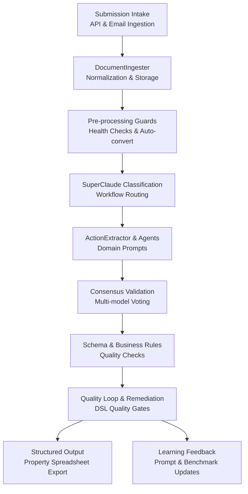
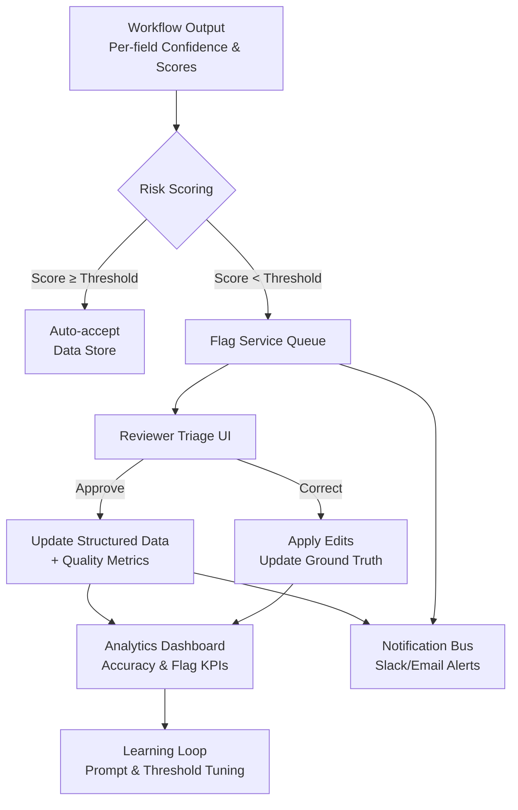

# DocAutomate Ingestion Strategy for 95% Accuracy

DocAutomate’s orchestration-first design already aligns with a 95% extraction target because ingestion, multi-agent extraction, and quality loops are first-class concepts rather than bolt-ons (`ingester.py:62`, `extractor.py:83`, `workflows/universal-document.yaml:27`). It still needs spreadsheet-specific adapters and tighter evaluation plumbing, but the scaffolding is in place.

## 1. AI Pipeline
- Pipeline overview:

- **Ingestion & normalization**: reuse the FastAPI upload endpoints and `DocumentIngester` for PDFs, images, and emails while adding an IMAP/SMTP listener plus `.xlsx/.csv` handlers that flatten sheets into canonical JSON before hashing and queuing (`ingester.py:62`, `ingester.py:225`).
- **Pre-processing guardrails**: run document health checks (page count, encoding, language, template heuristics) and auto-convert with `FileOperations.batch_convert_documents` for nonstandard layouts, escalating to Claude for semantic conversion when `use_claude=True` (`utils/file_operations.py:168`).
- **Layout & context decomposition**: hand off to SuperClaude classification prompts to route each payload to a domain-specific extraction workflow; ActionExtractor auto-detects document type and selects tuned prompts for emails, reports, NDAs, etc. (`extractor.py:111`, `extractor.py:147`).
- **Field extraction & consensus**: trigger YAML workflows with multi-model delegates and consensus validation so GPT-5 and Claude Opus vote on entity values before they are persisted (`workflow.py:48`, `tests/test_consensus_pipeline.py:67`).
- **Validation loop**: apply schema, range, and cross-field checks, log a `quality_score`, and re-route low-confidence submissions through quality-improvement steps defined in the DSL (`workflows/universal-document.yaml:179`, `Document.quality_score` in `ingester.py:53`).
- **Continuous learning**: feed back acceptance/rejection outcomes plus the 400 ground-truth submissions into prompt refinements, few-shot exemplars, and evaluation dashboards; keep a hold-out benchmark for regression testing.

Alternatives considered: full custom OCR stack (e.g., Tesseract + LayoutLM) offers offline control but adds significant engineering overhead; off-the-shelf SaaS (Azure Document Intelligence, Google Document AI) accelerates onboarding but conflicts with DocAutomate’s Claude-first delegation model and may reduce explainability.

## 2. Tooling to hit 0.95 accuracy
- **Intake/watchers**: FastAPI upload controller + IMAP/POP poller + storage service for lineage, backed by `DocumentIngester`; supplement with `pandas`/`openpyxl` for spreadsheet parsing and `python-email` for MIME disassembly.
- **Extraction core**: ActionExtractor with Claude delegates, plus SuperClaude multi-agent modes for redundancy; layer in Azure Document Intelligence or Google Document AI as optional baseline comparators when Claude confidence dips.
- **Field-level scoring**: track per-field softmax/confidence from Claude responses, the consensus agreement score, and deterministic business rules (e.g., occupancy type ∈ allowed taxonomy); persist per-field accuracy targets to monitor drift.
- **Submission-level scoring**: combine field accuracies, document-level heuristics (OCR noise, table completeness), and workflow health metrics to compute an overall `quality_score` and adherence to the 0.95 "perfect extraction" bar.
- **Quality gates & analytics**: use DocAutomate’s DSL `quality_threshold` blocks to enforce minimum scores, while observability dashboards compare rolling averages against SLA.

## 3. Accuracy evaluation strategy
- **Dataset management**: split the 400 manually labelled submissions into train/validation/test (70/15/15), stratified by broker and document type to avoid leakage; version them in a feature store so retraining is reproducible.
- **Metrics**: compute per-field precision, recall, F1, and exact-match rate; translate to a binary "pass/fail" threshold per field to measure the 0.95 goal and aggregate to submission-level pass rate. Use normalized edit distance for free-text attributes and Cohen’s κ between model consensus and human adjudication.
- **Automation**: nightly regression runs replay the benchmark set through DocAutomate’s workflows via CLI, storing outcomes and diffs.
- **Human-in-the-loop**: sampling plan escalates a small percentage of "passes" for blind review to detect silent drift; all flagged "fails" feed into prompt tuning and rule updates.
- **Reporting**: create a quarterly accuracy review deck summarizing metrics, error taxonomy, and remediation velocity; extend DocAutomate’s decision logs with ADR-style updates when thresholds change.

## 4. Flagging system architecture
- Flagging control flow:

- **Real-time scoring**: after each workflow, emit per-field confidence, consensus agreement, schema validation result, and `quality_score`; compute a composite risk score and compare to tiered thresholds (green/yellow/red).
- **Flag service**: persist flagged submissions in a review queue with provenance so analysts can correct data quickly.
- **Notification layer**: use DocAutomate’s workflow actions to push Slack/email alerts when red-tier items appear, batch yellow-tier summaries, and open Jira tickets if SLA breach risk is detected.
- **Feedback capture**: reviewer decisions update the ground-truth dataset, adjust confidence calibration, and inform active learning loops; the workflow engine already supports rerouting via `quality_gate` steps when thresholds are missed (`workflows/universal-document.yaml:255`).
- **Audit trail**: log every flag, reviewer action, and final disposition for compliance and continuous improvement.

## Next Steps
1. Prototype spreadsheet/email adapters and confidence-calibrated flagging on the five provided samples plus a 50-document pilot cohort.
2. Stand up the automated benchmark harness and review dashboard so accuracy gains and regression risks are visible before production rollout.
